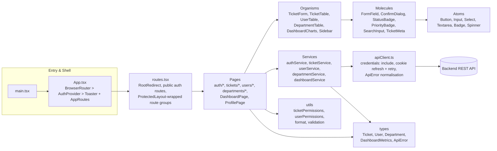
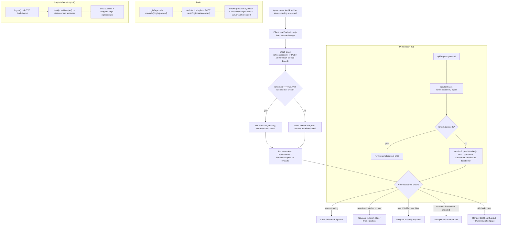
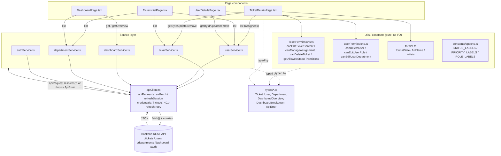
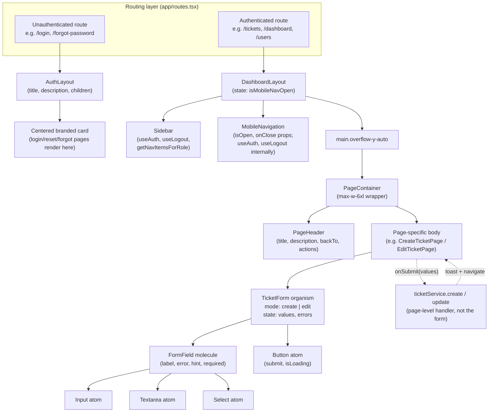
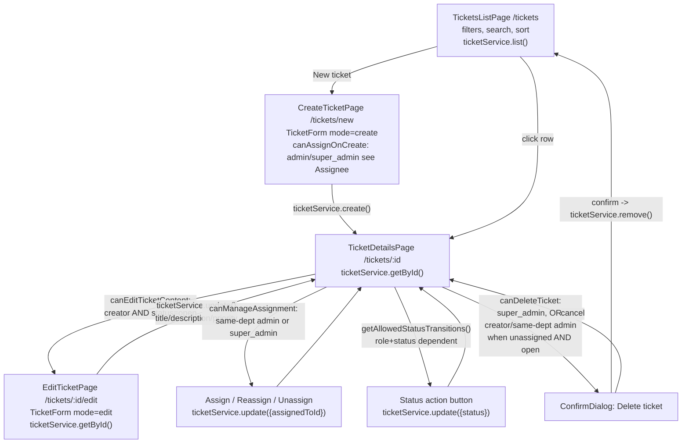
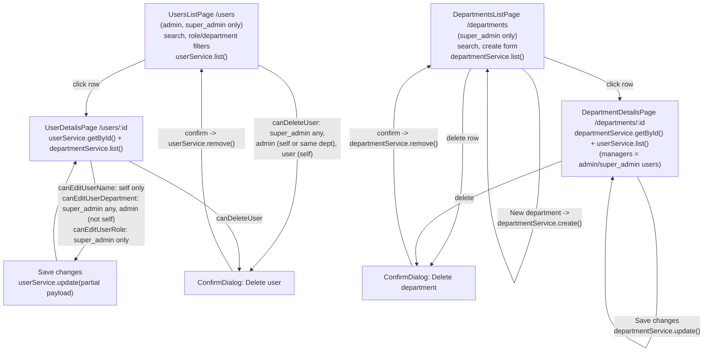

# Ticket Management System: Frontend Technical Documentation

**Internal engineering reference. Confidential, do not share outside the project team.**

This document is a complete, file-by-file and flow-by-flow walkthrough of the Frontend application in this repository (`Frontend/`). It covers the build tooling, the application bootstrap, routing and authentication, the services and domain types, every reusable component (atoms, molecules, organisms, templates), every page, the permission model, and the testing strategy. It is meant to let an engineer who has never opened this codebase understand exactly how it works without reading the source line by line themselves, though every claim below is drawn directly from the source and can be cross-checked against the referenced file paths.

No secrets, credentials, or client business data are reproduced in this document. Where the source code contains a placeholder string used in the UI (for example the em dash `"—"` shown when a field is empty), it is quoted as-is because it is part of the product's behavior, not because it is being used as punctuation in this document's own prose.

## Table of Contents

0. [Overview & Tech Stack](#0-overview--tech-stack)
1. [Application Bootstrap, Routing & Authentication](#1-application-bootstrap-routing--authentication)
2. [Services, Domain Types & Utilities](#2-services-domain-types--utilities)
3. [Atomic Components (Atoms)](#3-atomic-components-atoms)
4. [Composite Components (Molecules)](#4-composite-components-molecules)
5. [Complex Components (Organisms)](#5-complex-components-organisms)
6. [Layout & Template Components](#6-layout--template-components)
7. [Authentication Pages & User Journeys](#7-authentication-pages--user-journeys)
8. [Core Application Pages: Dashboard, Tickets, Users & Departments](#8-core-application-pages-dashboard-tickets-users--departments)
9. [Build Tooling, Configuration & Testing Strategy](#9-build-tooling-configuration--testing-strategy)
10. [Appendix: File Index & Glossary](#10-appendix-file-index--glossary)

---

## 0. Overview & Tech Stack

**What this application is.** A ticket management system with three user roles (`user`, `admin`, `super_admin`), department-scoped permissions, and a ticket lifecycle that moves through `open -> assigned -> in_progress -> reviewed -> completed -> closed`. Plain users create and track tickets; department admins assign and review tickets for their own department; super admins have system-wide visibility, manage departments, and are the only role that can change another user's role.

**Core stack:**
- **React 19** (`react`, `react-dom` ^19.2.8) with function components and hooks throughout; no class components anywhere in the source tree.
- **React Router 7** (`react-router-dom` ^7.18.3) using `BrowserRouter`, nested layout routes, and `Navigate`/`Outlet` for guarding.
- **Vite 8** as the build tool and dev server (`vite.config.ts`), with the official `@vitejs/plugin-react` and `@tailwindcss/vite` plugins.
- **Tailwind CSS 4** for all styling; there are no CSS Modules or styled-components, every visual variant in the component library is expressed as Tailwind class strings, typically selected through small `Record<Variant, string>` lookup maps.
- **TypeScript** (`typescript` ~6.0.2) in strict mode across the whole `src/` tree, with domain types centralized under `src/types/`.
- **react-hot-toast** for all success/error notifications, mounted once at the root (`App.tsx`) and triggered from anywhere via the imperative `toast` API.
- **Vitest 4** + **@testing-library/react** + **jsdom** for unit/component tests (every component and page in the tree has a matching `*.test.tsx` file).
- **Playwright** for end-to-end tests (`e2e/*.spec.ts`), which intercept all `/api/**` calls with `page.route()` rather than hitting a real backend.
- **oxlint** for linting (`npm run lint`).

**Authentication model.** There is no client-visible token: the app relies entirely on httpOnly cookies set by the backend, sent automatically via `fetch(..., { credentials: "include" })`. The only client-side persisted artifact is a non-sensitive snapshot of the current user (`SafeUser`) cached in `sessionStorage` so the UI can render immediately on reload while a background call confirms the session is still valid.

**High-level architecture:**



The remaining sections work outward from this diagram: bootstrap and auth first, then the data layer, then the component library from smallest to largest, then every page grouped by feature area, and finally tooling and testing.

---

## 1. Application Bootstrap, Routing & Authentication

### 1.1 `src/main.tsx`

**Purpose:** This is the Vite/React entry point. It mounts the root `App` component into the DOM inside React's `StrictMode`.

**Contents:**
- **Imports:** `StrictMode` from `react` (wraps the tree to surface unsafe lifecycle patterns and, in development, double-invoke effects/renders so bugs like missing cleanup are caught early); `createRoot` from `react-dom/client` (React 18/19's concurrent-capable root API); the global stylesheet `./index.css`; and the named export `App` from `./app/App`.
- **Logic:** It looks up `document.getElementById("root")`. If that element is missing, it throws `new Error("Root element not found")`, which fails fast at startup rather than silently rendering nothing. If found, it calls `createRoot(rootElement).render(...)`, rendering `<StrictMode><App /></StrictMode>`.
- **Interaction with other files:** This file is the sole caller of `App`; everything else in the bootstrap chain (routing, auth, layout) is reached transitively through `App`.

### 1.2 `src/app/App.tsx`

**Purpose:** Defines the top-level `App` component that wires together the router, the global toast notification host, and the authentication provider, establishing the provider order for the whole application.

**Contents:**
- **Imports:** `BrowserRouter` from `react-router-dom` (HTML5-history-based router, needed so route paths like `/tickets/:id` work via the browser's History API); `Toaster` from `react-hot-toast` (renders toast notifications triggered anywhere in the app via the `toast` API); `AuthProvider` from `./providers/AuthProvider`; `AppRoutes` from `./routes`.
- **Exported component `App`:** Renders `<BrowserRouter>` as the outermost element, then inside it `<AuthProvider>`, and inside that, two siblings: `<Toaster position="top-right" toastOptions={{ duration: 4000 }} />` and `<AppRoutes />`.
- **Nesting rationale:** `BrowserRouter` must wrap everything that uses routing hooks (`useNavigate`, `useLocation`), and `AuthProvider` wraps `AppRoutes` because route guarding (in `ProtectedLayout`, `RootRedirect`) depends on `useAuth()`, which requires an ancestor `AuthProvider`. The `Toaster` is a sibling of `AppRoutes` inside `AuthProvider` so that toasts triggered by auth actions (login errors, session expiry, logout) render globally regardless of which route is active. `Toaster` renders no visible children itself; it is a portal-style host that listens for `toast.*()` calls anywhere in the tree, which is why `AuthProvider`'s session-expiry handler and `useLogout` can call `toast.error(...)` / `toast.success(...)` without any prop plumbing.

### 1.3 `src/app/routes.tsx`

**Purpose:** Defines the entire client-side route table, including a smart root redirect, public auth routes, and role-gated route groups nested inside `ProtectedLayout`.

**Contents:**
- **Imports:** `Navigate`, `Route`, `Routes` from `react-router-dom`; `ProtectedLayout` (the auth/role guard + shell layout); `Spinner` (loading indicator, atoms component); `useAuth` hook; `getDefaultRouteForRole` from `../constants/navigation`; and every page component used in the tree (auth pages, dashboard, tickets, profile, users, departments, and the fallback `UnauthorizedPage`/`NotFoundPage`).

- **`RootRedirect` (local, unexported function component):** Rendered at path `/`. It calls `useAuth()` to get `user` and `status`.
  - If `status === "loading"`, it renders a full-viewport (`h-screen`) centered `<Spinner size="lg" />`. This is the same loading UI pattern used in `ProtectedLayout`, so the user sees a blank spinner screen at `/` while `AuthProvider`'s session-restoration effect is still resolving.
  - Else if `status === "unauthenticated"` or `!user` (defensive double-check even though these two conditions should be consistent), it returns `<Navigate to="/login" replace />`.
  - Else if `!user.isVerified`, it returns `<Navigate to="/verify-required" replace />`.
  - Otherwise it returns `<Navigate to={getDefaultRouteForRole(user.role)} replace />`, sending `role: "user"` to `/tickets` and any other role to `/dashboard` (per `getDefaultRouteForRole` in `constants/navigation.ts`).
  - All three `Navigate` calls use `replace`, so `/` never stays in browser history, preventing back-button loops back to the redirect.

- **Exported `AppRoutes` component:** Renders a single `<Routes>` tree with the following flat/nested structure:

  1. `path="/"` -> `<RootRedirect />` (no layout, no guard of its own; delegates to auth state as above).

  2. **Public routes** (no `ProtectedLayout`, accessible whether or not authenticated):
     - `/login` -> `LoginPage`
     - `/register` -> `RegisterPage`
     - `/verify-email/:token` -> `VerifyEmailPage`
     - `/resend-verification` -> `ResendVerificationPage`
     - `/change-password` -> `ChangePasswordPage`
     - `/changepassword/email` -> `ForgotPasswordPage`
     - `/changepassword/verify/:token` -> `ResetPasswordPage`

  3. **Authenticated-but-not-necessarily-verified route:**
     - `/verify-required` -> `VerificationRequiredPage`. Notably this route is *not* nested inside `ProtectedLayout`, so it performs no auth check of its own here; it is simply the destination that `RootRedirect` and `ProtectedLayout` redirect unverified users to.

  4. **Authenticated + verified group**, nested inside `<Route element={<ProtectedLayout />}>` (no `roles` prop, so any authenticated+verified user of any role passes):
     - `/tickets` -> `TicketsListPage`
     - `/tickets/new` -> `CreateTicketPage`
     - `/tickets/:id` -> `TicketDetailsPage`
     - `/tickets/:id/edit` -> `EditTicketPage`
     - `/profile` -> `ProfilePage`
     - `/profile/change-password` -> `ProfileChangePasswordPage`
     - `/unauthorized` -> `UnauthorizedPage` (reachable by any verified user; it is the destination `ProtectedLayout` redirects to when a role check fails elsewhere)

  5. **Admin + super admin group**, nested inside `<Route element={<ProtectedLayout roles={["admin", "super_admin"]} />}>`:
     - `/dashboard` -> `DashboardPage`
     - `/users` -> `UsersListPage`
     - `/users/:id` -> `UserDetailsPage`

  6. **Super admin only group**, nested inside `<Route element={<ProtectedLayout roles={["super_admin"]} />}>`:
     - `/departments` -> `DepartmentsListPage`
     - `/departments/:id` -> `DepartmentDetailsPage`

  7. **Catch-all:** `path="*"` -> `NotFoundPage`, matches any URL not matched above (no guard, publicly visible 404).

  Each `<Route element={<ProtectedLayout .../>}>` block is a **layout route**: `ProtectedLayout` itself performs the auth/role check and, if it passes, renders `<DashboardLayout><Outlet /></DashboardLayout>`, and React Router substitutes the matched child route (e.g. `TicketsListPage`) into that `<Outlet />`. Because there are three separate `ProtectedLayout` route elements (default, admin-tier, super-admin-tier), each with different `roles` props, the guard logic and its role list are re-evaluated independently per group; a `super_admin` user visiting `/tickets` is checked against the first group's guard (no `roles` restriction) and passes, while the same user visiting `/departments` is checked against the third group's guard (`roles: ["super_admin"]`).

**Route hierarchy diagram:**

```mermaid
flowchart TD
    Root["/ -> RootRedirect\n(checks auth status/role)"]

    subgraph Public["Public routes (no guard)"]
        Login["/login -> LoginPage"]
        Register["/register -> RegisterPage"]
        VerifyEmail["/verify-email/:token -> VerifyEmailPage"]
        ResendVerif["/resend-verification -> ResendVerificationPage"]
        ChangePw["/change-password -> ChangePasswordPage"]
        ForgotPw["/changepassword/email -> ForgotPasswordPage"]
        ResetPw["/changepassword/verify/:token -> ResetPasswordPage"]
    end

    VerifyRequired["/verify-required -> VerificationRequiredPage\n(authenticated, unverified)"]

    subgraph PL1["ProtectedLayout (no roles restriction)"]
        Tickets["/tickets -> TicketsListPage"]
        TicketsNew["/tickets/new -> CreateTicketPage"]
        TicketDetail["/tickets/:id -> TicketDetailsPage"]
        TicketEdit["/tickets/:id/edit -> EditTicketPage"]
        Profile["/profile -> ProfilePage"]
        ProfilePw["/profile/change-password -> ProfileChangePasswordPage"]
        Unauthorized["/unauthorized -> UnauthorizedPage"]
    end

    subgraph PL2["ProtectedLayout roles=[admin, super_admin]"]
        Dashboard["/dashboard -> DashboardPage"]
        Users["/users -> UsersListPage"]
        UserDetail["/users/:id -> UserDetailsPage"]
    end

    subgraph PL3["ProtectedLayout roles=[super_admin]"]
        Departments["/departments -> DepartmentsListPage"]
        DeptDetail["/departments/:id -> DepartmentDetailsPage"]
    end

    NotFound["* -> NotFoundPage"]

    Root -. "loading" .-> Spinner1["Spinner (full screen)"]
    Root -. "unauthenticated" .-> Login
    Root -. "authenticated, not verified" .-> VerifyRequired
    Root -. "authenticated, verified, role=user" .-> Tickets
    Root -. "authenticated, verified, role=admin/super_admin" .-> Dashboard
```



### 1.4 `src/app/providers/AuthContext.ts`

**Purpose:** Declares the shape of the authentication context (`AuthContextValue`), the `AuthStatus` union type, and creates the untyped-default `AuthContext` object consumed by `useAuth`.

**Contents:**
- **Imports:** `createContext` from `react`; type-only imports `LoginPayload` and `RegisterPayload` from `../../services/authService`; type-only import `SafeUser` from `../../types/user`.
- **Exported type `AuthStatus`:** `"loading" | "authenticated" | "unauthenticated"`, the three possible states of session resolution.
- **Exported interface `AuthContextValue`:**
  - `user: SafeUser | null` - the current user snapshot, per `types/user.ts`'s comment describing it as a "minimal, non-sensitive snapshot kept in sessionStorage to survive page reloads".
  - `status: AuthStatus`.
  - `login(payload: LoginPayload): Promise<SafeUser>`.
  - `register(payload: RegisterPayload): Promise<SafeUser>`.
  - `logout(): Promise<void>`.
  - `setUser(user: SafeUser | null): void` - an escape hatch letting other code (e.g. a profile-edit page) push an updated user snapshot into context without going through `login`/`register`.
- **Exported `AuthContext`:** `createContext<AuthContextValue | undefined>(undefined)`. The default is `undefined` (not a stub object) specifically so `useAuth` can detect "no provider mounted" and throw, rather than silently handing out broken no-op functions.

### 1.5 `src/app/providers/AuthProvider.tsx`

**Purpose:** Implements the `AuthContext` provider: it owns the `user`/`status` state, restores a session on app startup by combining a cached user snapshot with a cookie-based refresh check, exposes `login`/`register`/`logout`/`setUser`, and wires up a global "session expired" callback used by the API client's 401-handling logic.

**Contents:**
- **Imports:** `useCallback`, `useEffect`, `useMemo`, `useState` from React; type `ReactNode`; `toast` from `react-hot-toast`; `authService` and types `LoginPayload`/`RegisterPayload` from `../../services/authService`; `refreshSession` and `setSessionExpiredHandler` from `../../services/apiClient`; type `SafeUser`; `ApiError` from `../../types/api`; `AuthContext` and its types from `./AuthContext`.
- **Module-level constant:** `SESSION_STORAGE_KEY = "tms.session.user"`.
- **`readCachedUser()`:** Reads `sessionStorage.getItem(SESSION_STORAGE_KEY)`, `JSON.parse`s it as `SafeUser` if present, and returns `null` on any thrown error (e.g. corrupted JSON) or absence. Uses `sessionStorage`, not `localStorage`, so the cached user is scoped to the tab/session and cleared when the tab closes.
- **`writeCachedUser(user)`:** If `user` is truthy, `sessionStorage.setItem`s the JSON-stringified value; if falsy, `removeItem`s the key. Wrapped in try/catch with a comment noting `sessionStorage` may be unavailable in private browsing, in which case the write is silently ignored.
- **Exported `AuthProvider({ children })`:**
  - **State:** `user` (via `setUserState`, initial `null`) and `status` (via `setStatus`, initial `"loading"`).
  - **`setUser` (memoized callback, no deps):** Combines updating both React state (`setUserState(next)`) and the sessionStorage cache (`writeCachedUser(next)`), and derives `status` from the new value: `next ? "authenticated" : "unauthenticated"`. This is the single choke point used by `login`, `register`, and the session-expired handler to keep `user`, `status`, and the cache in sync.
  - **Effect 1 (session restoration, runs once on mount, empty dep array):**
    - Declares a `cancelled` flag for cleanup-based race protection.
    - `restoreSession` async function: reads `cached = readCachedUser()`, then `await refreshSession()` (a POST to `/auth/refresh` that relies on an httpOnly refresh-token cookie sent via `credentials: "include"`; see `apiClient.ts`). If `cancelled` (component unmounted before the request resolved), it exits without touching state, avoiding a "set state on unmounted component" warning/race.
    - If both `refreshed` (server confirmed the refresh cookie is valid) and `cached` (a prior user snapshot exists) are truthy, it sets `setUserState(cached)` and `setStatus("authenticated")` directly (bypassing the `setUser` helper, so it does not re-write the cache since it is already the source of the cached value).
    - Otherwise (refresh failed, or no cached user even though refresh succeeded), it calls `writeCachedUser(null)` and `setStatus("unauthenticated")`.
    - This is the mechanism by which the app "knows" whether a user is logged in on load: the backend, per the code comment, exposes no `/auth/me` or `/users/me` endpoint, so profile data cannot be independently re-fetched; the only server-verifiable signal is whether `/auth/refresh` succeeds (i.e., the refresh-token cookie is still valid), and the profile itself must come from the last cached snapshot written after a successful login/register. This means if `sessionStorage` is cleared or unavailable (e.g. a different tab, private browsing edge cases, or manual cache clearing) while the refresh cookie is still valid, the effect falls into the "otherwise" branch and forces `unauthenticated` even though the server-side session is technically still alive, because there is no cached profile to hydrate `user` with. This is a deliberate but non-obvious limitation worth flagging.
    - Cleanup function sets `cancelled = true`.
  - **Effect 2 (session-expired handler wiring, runs once on mount, empty dep array):** Calls `setSessionExpiredHandler(callback)` where the callback clears `user` to `null` (via `setUserState(null)`), clears the cache (`writeCachedUser(null)`), sets `status` to `"unauthenticated"`, and shows `toast.error("Your session has expired. Please sign in again.")`. On unmount, cleanup calls `setSessionExpiredHandler(null)` to deregister. This handler is invoked from `apiClient.ts`'s `apiRequest` whenever a request returns 401 even after an attempted token refresh, giving `AuthProvider` a way to react to expiry detected anywhere in the app's API traffic, not just during explicit login/logout actions.
  - **`login` (memoized, deps `[setUser]`):** Calls `authService.login(payload)` (POST `/auth/login`), then `setUser(result.user)`, then returns `result.user`. Any thrown `ApiError` (e.g. invalid credentials) propagates to the caller (typically `LoginPage`) since it is not caught here.
  - **`register` (memoized, deps `[setUser]`):** Same pattern via `authService.register` (POST `/auth/register`).
  - **`logout` (memoized, deps `[setUser]`):** Calls `authService.logout()` (POST `/auth/logout`) inside try/catch; if the caught error is not an instance of `ApiError`, it is re-thrown (so unexpected non-API errors, like a network-layer exception, still surface); if it *is* an `ApiError` (e.g. the server already considers the session invalid), it is swallowed. The `finally` block always calls `setUser(null)` regardless of whether the API call succeeded, so the client-side session is cleared even if the server logout request failed.
  - **`value` (memoized via `useMemo`, deps `[user, status, login, register, logout, setUser]`):** The full `AuthContextValue` object `{ user, status, login, register, logout, setUser }`, memoized to avoid needless re-renders of consumers when unrelated provider re-renders occur.
  - Renders `<AuthContext.Provider value={value}>{children}</AuthContext.Provider>`.

### 1.6 `src/hooks/useAuth.ts`

**Purpose:** A thin, safe accessor hook for `AuthContext` that throws a descriptive error if used outside an `AuthProvider`, rather than allowing `undefined` to be destructured unsafely.

**Contents:**
- **Imports:** `useContext` from React; `AuthContext` from `../app/providers/AuthContext`.
- **Exported `useAuth()`:** Calls `useContext(AuthContext)`. If `ctx` is falsy (i.e., `undefined`, the context's default value), throws `new Error("useAuth must be used within an AuthProvider")`. Otherwise returns `ctx` (typed as `AuthContextValue`). Every consumer in the app (`RootRedirect`, `ProtectedLayout`, pages, `useLogout`) goes through this hook rather than calling `useContext(AuthContext)` directly, centralizing the "no provider" guard.

### 1.7 `src/hooks/useLogout.ts`

**Purpose:** A convenience hook that combines the context's `logout()` call with a success toast and a forced navigation back to `/login`, used by UI elements like a logout button.

**Contents:**
- **Imports:** `useNavigate` from `react-router-dom`; `toast` from `react-hot-toast`; `useAuth` from `./useAuth`.
- **Exported `useLogout()`:** Destructures `logout` from `useAuth()` and obtains `navigate` from `useNavigate()`. Returns an async function (not memoized with `useCallback`, so a new function identity is produced on every render of the consuming component) that:
  1. `try`: `await logout()` (the context's logout, which calls `authService.logout()` and always clears `user`/`status`/cache per the `finally` in `AuthProvider`), then `toast.success("Logged out successfully")`.
  2. `finally`: `navigate("/login", { replace: true })` runs unconditionally, even if `logout()` throws (which per `AuthProvider.logout`'s own try/catch/finally should only happen for non-`ApiError` exceptions, since `ApiError`s are swallowed there). Using `replace: true` avoids leaving the now-invalid authenticated page in browser history, so pressing "back" after logout does not flash the stale protected page.

### 1.8 `src/components/layout/ProtectedLayout.tsx`

**Purpose:** The route-guarding layout component used as the `element` of parent `<Route>`s in `routes.tsx`. It enforces authentication, email verification, and optional role-based authorization before rendering the shared `DashboardLayout` shell and the matched child route via `<Outlet />`.

**Contents:**
- **Imports:** `Navigate`, `Outlet`, `useLocation` from `react-router-dom`; `Spinner` from `../atoms/Spinner`; `DashboardLayout` from `../templates/DashboardLayout`; `useAuth` from `../../hooks/useAuth`; type `UserRole` from `../../types/user`.
- **`ProtectedLayoutProps` interface:** `{ roles?: UserRole[] }`, an optional allow-list of roles; when omitted, any authenticated+verified user passes.
- **Exported `ProtectedLayout({ roles })`:**
  - Calls `useAuth()` to get `user` and `status`, and `useLocation()` to capture the current location object.
  - **Branch 1 - `status === "loading"`:** Renders a full-screen centered `<Spinner size="lg" />` (identical markup pattern to `RootRedirect`). This covers the window between mount and `AuthProvider`'s session-restoration effect resolving, preventing a flash of a redirect to `/login` before the cached session has had a chance to be validated.
  - **Branch 2 - `status === "unauthenticated" || !user`:** Renders `<Navigate to="/login" replace state={{ from: location }} />`. The `state={{ from: location }}` payload is attached to the navigation so that `LoginPage` (see section 7.1) can read `location.state?.from` to redirect the user back to the page they originally tried to reach after a successful login.
  - **Branch 3 - `!user.isVerified`:** Renders `<Navigate to="/verify-required" replace />` (no `state` passed here, unlike branch 2).
  - **Branch 4 - `roles && !roles.includes(user.role)`:** Renders `<Navigate to="/unauthorized" replace />`. Only reached if `roles` was provided by the specific `<Route element={<ProtectedLayout roles={...} />}>` wrapping the matched child, and the current user's role is not in that list.
  - **Fallback (all checks passed):** Renders `<DashboardLayout><Outlet /></DashboardLayout>`, where `<Outlet />` is substituted by React Router with whichever nested `<Route>` element matched the current path (e.g. `TicketsListPage`, `DashboardPage`, etc., per the route table in `routes.tsx`).
  - All `Navigate` calls use `replace`, keeping guard redirects out of browser history.

### 1.9 `src/constants/navigation.ts`

**Purpose:** Centralizes the app's navigation menu definition and two small role-based helper functions used elsewhere (route redirection and the sidebar/nav-menu components).

**Contents:**
- **Import:** type `UserRole` from `../types/user`.
- **Exported interface `NavItem`:** `{ label: string; to: string; roles: UserRole[] }`.
- **Exported constant `NAV_ITEMS: NavItem[]`:** Five entries:
  - `Dashboard` -> `/dashboard`, roles `["admin", "super_admin"]`
  - `Tickets` -> `/tickets`, roles `["user", "admin", "super_admin"]`
  - `Users` -> `/users`, roles `["admin", "super_admin"]`
  - `Departments` -> `/departments`, roles `["super_admin"]`
  - `Profile` -> `/profile`, roles `["user", "admin", "super_admin"]`
  - These role lists line up exactly with the `roles` props passed to `ProtectedLayout` in `routes.tsx` for the corresponding paths, so the visible nav menu and the enforced route guard are kept consistent (though nothing in the code enforces this consistency automatically; it is maintained by convention).
- **Exported `getNavItemsForRole(role: UserRole): NavItem[]`:** Filters `NAV_ITEMS` to those whose `roles` array includes the given `role`; consumed by `Sidebar` and `MobileNavigation` to render only the links a given user is allowed to see.
- **Exported `getDefaultRouteForRole(role: UserRole): string`:** Returns `/tickets` if `role === "user"`, otherwise `/dashboard`. This is the function `RootRedirect` (in `routes.tsx`) uses to decide where an authenticated, verified user landing on `/` should be sent, and is reused throughout the auth pages (section 7) for post-login redirects.

### 1.10 End-to-End Authentication Flow

**On initial app load:**
1. `main.tsx` mounts `App`, which mounts `BrowserRouter` -> `AuthProvider` -> `AppRoutes`.
2. `AuthProvider` initializes `status = "loading"`, `user = null`.
3. Its mount effect calls `readCachedUser()` (synchronous, from `sessionStorage`) and `await refreshSession()` (async, POSTs `/auth/refresh` with `credentials: "include"`, relying on an httpOnly cookie the browser attaches automatically; the frontend never touches the raw token).
4. Whatever route matched initially (e.g. `/`, or a protected route if the user deep-linked or refreshed the page) renders its loading branch: `RootRedirect` or `ProtectedLayout` both check `status === "loading"` and show a centered `Spinner` until this resolves.
5. When `refreshSession()` resolves: if it returned `true` **and** a cached user existed, `status` becomes `"authenticated"` and `user` is set from the cache. If either is missing, `status` becomes `"unauthenticated"` and the cache is cleared.
6. Once `status` is no longer `"loading"`, the guard/redirect components (`RootRedirect`, `ProtectedLayout`) re-render and make their real routing decision based on `user`/`status`.

**Login:**
1. `LoginPage` (section 7.1) calls `useAuth().login(payload)`.
2. `AuthProvider.login` calls `authService.login` -> POST `/auth/login`, which (per `apiClient.ts`) sends `credentials: "include"` so the server can set session/refresh cookies in the response.
3. On success, `setUser(result.user)` is called: this sets React state, calls `writeCachedUser` to persist the `SafeUser` snapshot to `sessionStorage`, and sets `status = "authenticated"`.
4. Any route depending on `useAuth()` re-renders; guarded routes now pass branch checks (assuming `isVerified` and role match) and render their content, or `RootRedirect`/deep-linked protected routes send the user to their role's default landing page.

**Logout:**
1. A UI element calls the function returned by `useLogout()`.
2. That function calls the context's `logout()` (from `AuthProvider`), which POSTs `/auth/logout` (clearing server-side session/cookie state) and, in its `finally` block, calls `setUser(null)` regardless of API outcome, clearing React state, the sessionStorage cache, and setting `status = "unauthenticated"`.
3. `useLogout` then shows a success toast and calls `navigate("/login", { replace: true })`.

**Session expiry mid-session (e.g. token expired while browsing):**
1. Any `apiRequest` call that returns 401 (and is not one of the excluded auth endpoints, and is not already a retry) triggers `apiClient.ts` to call `refreshSession()` itself.
2. If that refresh also fails, `apiClient.ts` invokes the module-level `sessionExpiredHandler`, which `AuthProvider`'s second effect registered via `setSessionExpiredHandler`.
3. That handler clears `user`, clears the cache, sets `status = "unauthenticated"`, and shows `toast.error("Your session has expired. Please sign in again.")`.
4. Because `status` changed, any currently mounted `ProtectedLayout` re-renders and its "unauthenticated" branch fires, redirecting to `/login` with `state={{ from: location }}` so the user can potentially be routed back after re-authenticating.

**Route guard enforcement (`ProtectedLayout`) and unauthorized access:**
- Not logged in -> redirect to `/login` (with return-location state).
- Logged in, not verified -> redirect to `/verify-required`.
- Logged in, verified, role not permitted for this route group -> redirect to `/unauthorized`.
- All checks pass -> renders `DashboardLayout` wrapping the actual page via `<Outlet />`.

**Flow diagram of the end-to-end authentication lifecycle:**



**Notable subtleties and edge cases:**
- **No `/auth/me` endpoint:** the app cannot independently verify the cached profile against the server; it only verifies that the refresh cookie is still valid and trusts the last cached `SafeUser` snapshot. If the cache is missing (cleared storage, private browsing, different tab) but the cookie is still valid, the user is forced to `"unauthenticated"` anyway (see `AuthProvider.tsx` restoration effect, "otherwise" branch).
- **Refresh race coalescing:** `apiClient.ts`'s `refreshSession()` uses a module-level `refreshInFlight` promise to coalesce concurrent refresh calls into one network request, explicitly to protect against React StrictMode's double-invoked effects and multi-tab races against a rotating refresh token.
- **`ApiError` swallowing in `logout`:** `AuthProvider.logout` only re-throws non-`ApiError` exceptions; any `ApiError` (e.g. server says session already gone) is silently ignored, and the client-side state is cleared regardless via `finally`.
- **`useLogout` is not memoized:** it returns a new async function identity on every render, which is harmless for typical usage (e.g. an onClick handler) but means it's not stable as a `useEffect` dependency.
- **Redirect-state asymmetry:** the "unauthenticated" redirect in `ProtectedLayout` passes `state={{ from: location }}` for a post-login return trip, but the "unverified" and "role mismatch" redirects do not pass any state.
- **`RootRedirect` and `ProtectedLayout` duplicate logic:** both independently implement the same loading/unauthenticated/unverified branch structure (not shared via a common helper), so any future change to this logic must be kept in sync manually in both `routes.tsx` and `ProtectedLayout.tsx`.

---

## 2. Services, Domain Types & Utilities

This section documents the data-access layer (`src/services`), the shared domain type definitions (`src/types`), the pure helper logic (`src/utils`), and the static label/option constants (`src/constants/options.ts`) that together form the non-visual foundation of the frontend. All HTTP traffic in the application funnels through a single low-level client, `apiClient.ts`, which every service module wraps with resource-specific, strongly typed methods.

### 2.1 `src/services/apiClient.ts`

**Purpose:** The single low-level HTTP transport used by every other service in the app. It centralises base URL resolution, credential/cookie handling, JSON (de)serialisation, error normalisation, and silent session-refresh-and-retry logic so that individual service modules never touch `fetch` directly.

**Exports and internals, in detail:**

- `export const API_BASE_URL`: resolved once at module load as `import.meta.env.VITE_API_BASE_URL ?? "http://localhost:3001/api"`. This is a Vite build-time environment variable; if it is not defined (e.g. in local dev without a `.env`), the client falls back to `http://localhost:3001/api`.
- `interface RequestOptions { method?: "GET"|"POST"|"PATCH"|"DELETE"; body?: unknown; query?: Record<string, string | undefined> }`: the shape every internal call site builds before dispatching a request. Note there is no `PUT` option; the whole app only ever needs GET/POST/PATCH/DELETE.
- `sessionExpiredHandler` (module-level `let`, typed `(() => void) | null`) plus `export function setSessionExpiredHandler(handler: (() => void) | null): void`: a simple callback registration slot. The client itself has no notion of routing or React state; it just calls this handler when it determines the session is unrecoverable (see below). It is set from `src/app/providers/AuthProvider.tsx` (section 1.5), which is the only file that calls `setSessionExpiredHandler`.
- `function buildUrl(path: string, query?: Record<string, string | undefined>): string`: constructs a `URL` object from `API_BASE_URL + path`, then iterates `Object.entries(query)` and calls `url.searchParams.set(key, value)` for every entry whose value is neither `undefined` nor an empty string. This means query params that are `undefined` or `""` are silently omitted from the final URL rather than being serialised as `key=` or `key=undefined`, which is what allows service files to pass whole optional-filter objects straight through without pre-filtering them.
- `async function rawFetch(path: string, options: RequestOptions): Promise<Response>`: calls the native `fetch` with:
  - `method: options.method ?? "GET"`
  - `credentials: "include"` (always, on every request): this is how auth is actually attached: there is no `Authorization: Bearer <token>` header anywhere in this client. Authentication is entirely cookie-based (session cookie set by the backend), and `credentials: "include"` ensures the browser sends and accepts cookies cross-origin.
  - `headers`: `{ "Content-Type": "application/json" }` only if `options.body !== undefined`, otherwise `{}` (so GET/DELETE calls without a body send no Content-Type header).
  - `body`: `JSON.stringify(options.body)` if a body was supplied, else `undefined`.
- `interface ErrorBody { message?: string; errors?: string[] }`: the expected shape of a JSON error payload from the backend.
- `async function parseJson(res: Response): Promise<unknown>`: reads `res.text()` first (so an empty body doesn't throw on `.json()`), returns `undefined` for an empty string, otherwise `JSON.parse`s it inside a `try/catch`, swallowing parse errors by returning `undefined`. This guards against non-JSON responses (e.g. a proxy error page) crashing the caller.
- `function toApiError(status: number, body: unknown): ApiError`: casts the parsed body to `ErrorBody`, falls back to `{}` if `body` is nullish, extracts `message` (defaulting to `"Something went wrong. Please try again."`) and `errors`, and returns a `new ApiError(status, message, errors)` (the `ApiError` class is defined in `types/api.ts`, documented below).
- **Refresh coalescing.** `let refreshInFlight: Promise<boolean> | null = null;` plus `export function refreshSession(): Promise<boolean>`. If a refresh is not already running, it kicks off `rawFetch("/auth/refresh", { method: "POST" })`, resolves to `res.ok` (boolean), catches network errors to `false`, and in a `.finally()` clears `refreshInFlight` back to `null`. If a refresh *is* already in flight, subsequent callers get the same promise. The inline comment explains why this matters beyond just avoiding duplicate work: refresh tokens rotate on every use (single-use), so two concurrent refresh calls sharing the same refresh-token cookie would cause one of them to be rejected by the backend and the session to be dropped, e.g. under React StrictMode's double effect invocation on mount, or two browser tabs refreshing simultaneously.
- `const NO_REFRESH_RETRY_PATHS = new Set(["/auth/login", "/auth/register", "/auth/refresh", "/auth/logout"])`: paths that must never trigger the automatic refresh-and-retry flow on a 401, since a 401 from these endpoints legitimately means "bad credentials" or "no session to refresh/log out," not "access token expired."
- `export async function apiRequest<T>(path: string, options: RequestOptions = {}, isRetry = false): Promise<T>`, the main entry point every service calls:
  1. Performs the request via `rawFetch`.
  2. **401 handling with silent refresh-and-retry:** if `res.status === 401` and this is not already a retry (`!isRetry`) and the path is not in `NO_REFRESH_RETRY_PATHS`, it calls `refreshSession()`. If that resolves `true`, it recursively calls itself as `apiRequest<T>(path, options, true)` (the `isRetry` flag prevents infinite refresh loops, since a second 401 on retry falls through instead of refreshing again). If refresh fails, it invokes `sessionExpiredHandler?.()` (notifying `AuthProvider` so it can e.g. clear local user state and redirect to login) and then throws an `ApiError` built from the *original* 401 response body.
  3. Otherwise, parses the body and, if `!res.ok`, throws `toApiError(res.status, body)`.
  4. On success, returns the parsed body cast to `T`.

This design means every consumer of `apiRequest` gets: automatic cookie-based auth, automatic one-shot silent token refresh on expiry, and a normalised thrown `ApiError` (never a raw `Response` or generic `Error`) for any non-2xx status, including the case where refresh itself fails. There is no retry logic for other status codes (500s, network failures) beyond the single 401-refresh-retry, and there is no client-side request timeout/AbortController usage anywhere in this file.

### 2.2 `src/services/authService.ts`

**Purpose:** Wraps all authentication and account-lifecycle endpoints (register, login, refresh, logout, password change/reset, email verification) behind a single `authService` object built on `apiRequest`.

**Local types:**
- `RegisterPayload { firstName, lastName, email, password }`
- `LoginPayload { email, password }`
- `ChangePasswordPayload { email, oldPassword, newPassword }`
- `ResetPasswordPayload { token, email, newPassword }`
- `MessageResponse { message: string }` and `AuthResponse { message: string; user: User }` (private response shapes, not exported).

**Exported object `authService`, one property per endpoint:**
- `register(payload: RegisterPayload)` -> `POST /auth/register` with the payload as JSON body, returns `AuthResponse` (`{ message, user }`). Consumed by `RegisterPage.tsx` (section 7.2).
- `login(payload: LoginPayload)` -> `POST /auth/login`, returns `AuthResponse`. This is the endpoint underlying the app's `login()` function exposed via `useAuth()`/`AuthProvider`, which `LoginPage.tsx` calls.
- `refresh()` -> `POST /auth/refresh`, returns `MessageResponse`. Note this is distinct from `apiClient`'s internal `refreshSession()`, which hits the same path directly via `rawFetch` for the silent-retry mechanism; `authService.refresh` exists for any explicit/manual refresh call sites.
- `logout()` -> `POST /auth/logout`, returns `MessageResponse`.
- `changePassword(payload: ChangePasswordPayload)` -> `POST /auth/change-password` with `{ email, oldPassword, newPassword }`, returns `MessageResponse`. Used by `ProfileChangePasswordPage.tsx` and `ChangePasswordPage.tsx`.
- `forgotPassword(email: string)` -> `POST /auth/changepassword/email` with body `{ email }`, returns `MessageResponse`. Used by `ForgotPasswordPage.tsx`.
- `resetPassword(payload: ResetPasswordPayload)` -> `POST /auth/changepassword/verify/{token}` (token URI-encoded via `encodeURIComponent` and interpolated into the path), body `{ email, newPassword }` (note: `token` itself is not repeated in the body, only in the path), returns `MessageResponse`. Used by `ResetPasswordPage.tsx`.
- `verifyEmail(token: string)` -> `GET /auth/verify-email/{token}` (encoded), returns `MessageResponse`. Used by `VerifyEmailPage.tsx`.
- `resendVerification(email: string)` -> `POST /auth/resend-verification` with `{ email }`, returns `MessageResponse`. Used by `ResendVerificationPage.tsx` (and referenced from `VerificationRequiredPage.tsx`).

All nine methods are thin one-line wrappers; none of them do local validation, retries, or transformation beyond shaping the request. Errors from any of them surface as thrown `ApiError` instances from `apiRequest`, to be caught by the calling page (typically shown inline as a form error).

### 2.3 `src/services/dashboardService.ts`

**Purpose:** Fetches the two data sets that make up the analytics dashboard: a KPI/overview summary and a chart-oriented breakdown.

**Exported object `dashboardService`:**
- `get(departmentId?: string, period?: DashboardPeriod)` -> `GET /dashboard` with query params `{ departmentId, period }`, returns `DashboardBreakdown` (`{ message, priorityDistribution, ticketsOverTime }`).
- `getOverview(departmentId?: string, period?: DashboardPeriod)` -> `GET /dashboard/overview` with the same query params, returns `DashboardOverview` (the KPI counts, plus `departmentId`/`period` echoed back).

Both accept optional filters; per `buildUrl`'s query-stripping behaviour, an `undefined` `departmentId` or `period` is simply omitted, so the backend presumably treats a missing `departmentId` as "all departments" and a missing `period` as some server-side default. These two calls are combined by `DashboardPage.tsx` (section 8.1) into the richer `DashboardMetrics` view model, which also derives `statusDistribution` from the overview's per-status counts.

### 2.4 `src/services/departmentService.ts`

**Purpose:** CRUD access to department resources.

**Local response types:** `DepartmentListResponse { message, departments: Department[] }`, `DepartmentResponse { message, department: Department }`, `MessageResponse { message }`. Exported: `DepartmentQueryParams { departmentName?: string }`.

**Exported object `departmentService`:**
- `list(params: DepartmentQueryParams = {})` -> `GET /departments` with query `{ departmentName: params.departmentName }`, returns `DepartmentListResponse`. Consumed for filtering/searching departments by name.
- `getById(id: string)` -> `GET /departments/{id}`, returns `DepartmentResponse`.
- `create(payload: CreateDepartmentPayload)` -> `POST /departments`, body is the payload, returns `DepartmentResponse`.
- `update(id: string, payload: UpdateDepartmentPayload)` -> `PATCH /departments/{id}`, returns `DepartmentResponse`.
- `remove(id: string)` -> `DELETE /departments/{id}`, returns `MessageResponse`.

Consumed widely: `DashboardPage.tsx` (department filter dropdown), `CreateTicketPage.tsx` and `TicketsListPage.tsx` (department selector/filter for tickets), `DepartmentsListPage.tsx` and `DepartmentDetailsPage.tsx` (the department admin screens themselves), and `UsersListPage.tsx`/`UserDetailsPage.tsx` (department assignment for users).

### 2.5 `src/services/ticketService.ts`

**Purpose:** CRUD and filtered listing of tickets, the core resource of the app.

**Local response types:** `TicketListResponse { message, tickets: Ticket[] }`, `TicketResponse { message, ticket: Ticket }`, `MessageResponse { message }`.

**`function toQuery(params: TicketQueryParams): Record<string, string | undefined>`**: maps every field of `TicketQueryParams` (`title, status, priority, departmentId, assignedToId, createdById, createdFrom, createdTo, sortBy, sortOrder`) 1:1 into a plain query-param record, relying on `buildUrl`'s undefined/empty stripping to omit unset filters. This is a pure reshaping function with no validation.

**Exported object `ticketService`:**
- `list(params: TicketQueryParams = {})` -> `GET /tickets` with `toQuery(params)` as the query string, returns `TicketListResponse`. This is the workhorse behind `TicketsListPage.tsx`'s filter/sort UI (title search, status/priority/department/assignee/creator filters, `createdFrom`/`createdTo` date range, `sortBy`/`sortOrder`).
- `getById(id: string)` -> `GET /tickets/{id}`, returns `TicketResponse`. Used by `TicketDetailsPage.tsx`.
- `create(payload: CreateTicketPayload)` -> `POST /tickets`, returns `TicketResponse`. Used by `CreateTicketPage.tsx`.
- `update(id: string, payload: UpdateTicketPayload)` -> `PATCH /tickets/{id}`, returns `TicketResponse`. Used by `EditTicketPage.tsx` (content edits) and `TicketDetailsPage.tsx` (status transitions, assignment changes, since `UpdateTicketPayload` covers both title/description and status/assignedToId).
- `remove(id: string)` -> `DELETE /tickets/{id}`, returns `MessageResponse`. Used by `TicketDetailsPage.tsx`'s delete action.

### 2.6 `src/services/userService.ts`

**Purpose:** User directory access (list/get/update/delete).

**Local response types:** `UserListResponse { message, users: User[] }`, `UserResponse { message, user: User }`, `MessageResponse { message }`. Exported: `UserQueryParams { department?: string; firstName?: string; role?: UserRole }`.

**Exported object `userService`:**
- `list(params: UserQueryParams = {})` -> `GET /users` with query `{ department, firstName, role }`, returns `UserListResponse`. Used by `UsersListPage.tsx` (directory search/filter by name, department, role) and by ticket pages (`TicketsListPage.tsx`, `CreateTicketPage.tsx`, `TicketDetailsPage.tsx`) to populate assignee pickers.
- `getById(id: string)` -> `GET /users/{id}`, returns `UserResponse`. Used by `UserDetailsPage.tsx` and `ProfilePage.tsx` (viewing one's own or another user's profile).
- `update(id: string, payload: UpdateUserPayload)` -> `PATCH /users/{id}`, returns `UserResponse`. Payload covers `firstName, lastName, departmentId, role`, so this single endpoint backs both self-service profile edits and admin actions (department reassignment, role change) gated by the permission helpers in `userPermissions.ts`.
- `remove(id: string)` -> `DELETE /users/{id}`, returns `MessageResponse`. Used by `UsersListPage.tsx`/`UserDetailsPage.tsx`, gated by `canDeleteUser`.

### 2.7 Domain types (`src/types`)

**`api.ts`**: `export class ApiError extends Error { status: number; errors?: string[] }`. Constructor takes `(status, message, errors?)`, sets `this.name = "ApiError"`. This is the single normalised error shape thrown by `apiRequest` for every non-2xx response; UI code can `catch (err) { if (err instanceof ApiError) ... }` to read `.status` (e.g. to special-case 403/404/409) and `.errors` (field-level validation messages from the backend's zod schema, likely rendered as a list under a form).

**`dashboard.ts`**:
- `DashboardPeriod = "day" | "week" | "month" | "year"`: the time-window filter for dashboard queries.
- `StatusDistributionEntry { status: TicketStatus, count: number }` and `PriorityDistributionEntry { priority: TicketPriority, count: number }`: count-per-category rows for pie/bar charts.
- `TicketsOverTimeEntry { date: string, created: number, closed: number }`: one time-series data point: tickets created vs. closed on/around `date`.
- `DashboardBreakdown { message, priorityDistribution, ticketsOverTime }`: the exact shape of `GET /dashboard`. A code comment explains the split deliberately: this endpoint omits `departmentId`/`period`/counts/`statusDistribution` because those live on `DashboardOverview` instead, since the two endpoints are always fetched together and shouldn't duplicate each other's data.
- `DashboardOverview { message, departmentId: string | null, period, totalTickets, openTickets, assignedTickets, inProgressTickets, reviewedTickets, completedTickets, closedTickets }`: the KPI counts per ticket status, plus the echoed filter values, from `GET /dashboard/overview`.
- `DashboardMetrics extends DashboardOverview { statusDistribution, priorityDistribution, ticketsOverTime }`: a client-side-only view model (not returned directly by any endpoint) that `DashboardPage.tsx` assembles by combining one `getOverview` call and one `get` (breakdown) call, deriving `statusDistribution` itself from the overview's per-status counts.

**`department.ts`**:
- `Department { departmentId, departmentName, departmentEmail, managedBy: string | null, manager?: User | null, createdAt, updatedAt }`: `managedBy` is the manager's user id (foreign key); `manager` is the optionally-populated/expanded `User` object for that id.
- `CreateDepartmentPayload { departmentName, departmentEmail, managedBy?: string | null }` and `UpdateDepartmentPayload` (same three fields, all optional): creation/edit payloads.

**`ticket.ts`**, the central domain model:
- `TicketStatus = "open" | "assigned" | "in_progress" | "reviewed" | "completed" | "closed"`: the six-stage lifecycle.
- `TicketPriority = "low" | "medium" | "high" | "urgent"`.
- `Ticket { ticketId, title, description, status, priority, departmentId, department: Department, assignedToId: string | null, assignedTo: User | null, createdById, createdBy: User, createdAt, updatedAt, closedAt: string | null }`: the full ticket record as returned by the API, with both foreign-key ids and the expanded related objects (`department`, `assignedTo`, `createdBy`) always present. `closedAt` is only set once the ticket reaches `closed`.
- `CreateTicketPayload { title, description, departmentId, priority?, assignedToId?: string | null }`: priority defaults server-side if omitted; `assignedToId` may be pre-set at creation only by users permitted to do so (see `canAssignOnCreate` below).
- `UpdateTicketPayload { title?, description?, priority?, status?, assignedToId?: string | null }`: a single partial-update payload shape used for both content edits and status/assignment changes.
- `TicketSortBy = "createdAt" | "updatedAt" | "priority" | "status"`, `SortOrder = "asc" | "desc"`.
- `TicketQueryParams { title?, status?, priority?, departmentId?, assignedToId?, createdById?, createdFrom?, createdTo?, sortBy?, sortOrder? }`: the full filter/sort contract for `ticketService.list`.

**`user.ts`**:
- `UserRole = "user" | "admin" | "super_admin"`: the three-tier role model that drives every permission check in the app.
- `User { id, firstName, lastName, role, email, isVerified: boolean, departmentId: string | null, department?: Department | null, createdAt, updatedAt }`: the canonical user record. `departmentId` is nullable (a user, especially `super_admin`, need not belong to a department).
- `SafeUser = User`: documented in-code as "a minimal, non-sensitive snapshot kept in sessionStorage to survive page reloads."
- `UpdateUserPayload { firstName?, lastName?, departmentId?: string | null, role?: UserRole }`: note this does not include `email`, so email changes are not supported through this endpoint.

### 2.8 Utilities (`src/utils`)

**`format.ts`**, three small presentation-formatting helpers, no formatting library used:
- `formatDate(value: string | null | undefined): string`: returns `"—"` (the app's own em-dash placeholder string, part of the UI, not this document's punctuation) if `value` is falsy, or if `new Date(value)` is invalid (`Number.isNaN(date.getTime())`); otherwise formats via `date.toLocaleString(undefined, { year: "numeric", month: "short", day: "numeric", hour: "2-digit", minute: "2-digit" })`, i.e. locale-aware "Sep 6, 2026, 02:30 PM"-style output using the browser's default locale.
- `fullName(person: {firstName, lastName} | null | undefined): string`: returns `"Unassigned"` if `person` is nullish, otherwise `` `${firstName} ${lastName}`.trim() ``. Used pervasively across ticket, department, and user list/detail/table components.
- `initials(person: {firstName, lastName} | null | undefined): string`: returns `"?"` if `person` is nullish; otherwise takes `firstName.charAt(0)` + `lastName.charAt(0)`, uppercases the concatenation, and falls back to `"?"` if that concatenation is falsy/empty. Used by `Sidebar.tsx` for an avatar-style badge.

**`ticketPermissions.ts`**, the ticket authorisation rules mirrored client-side from the backend so the UI never offers actions the API would reject:
- `getRoleFlags(ticket: Ticket, user: User): RoleFlags` (private): computes four booleans: `isCreator` (`ticket.createdById === user.id`), `isAssignee` (`ticket.assignedToId === user.id`), `isSameDeptAdmin` (`user.role === "admin" && user.departmentId === ticket.departmentId`), `isSuperAdmin` (`user.role === "super_admin"`).
- `getAllowedStatusTransitions(ticket: Ticket, user: User): TicketStatus[]`: a doc comment states this "mirrors TicketService.validateStatusTransition exactly so the UI never offers an action the API will reject with a 403/400," a coupling worth flagging for maintenance. Logic:
  - **Super admin**: every status except the current one is allowed, *except* that any non-`"open"` target status is disallowed if the ticket has no `assignedToId` (you can't move an unassigned ticket into assigned/in_progress/reviewed/completed/closed).
  - **Same-department admin**: same base filtering, *plus* two extra restrictions: `"closed"` is only reachable from `"reviewed"`, and if the ticket is currently `"open"`, no transition at all is allowed except staying (dept admins cannot move a ticket out of `open` directly).
  - **Everyone else** (plain `"user"` role, or an admin who is neither same-department nor super, but who is creator/assignee): built from an explicit `Set<TicketStatus>`: if `isCreator` and current status is `"completed"`, they may move it to `"reviewed"` or back to `"open"`. If `isAssignee`: from `"assigned"` -> `"in_progress"`; from `"in_progress"` -> `"completed"`; from `"completed"` -> `"in_progress"` (re-opening work after being sent back). A user who is both creator and assignee gets the union of both rule sets.
  - Anyone not matching any of the above roles gets an empty array (no transitions allowed).
- `canEditTicketContent(ticket: Ticket, user: User): boolean`: true only if `ticket.createdById === user.id && ticket.status === "open"`. Only the original creator can edit title/description, and only while still `open`.
- `canManageAssignment(ticket: Ticket, user: User): boolean`: true if `isSameDeptAdmin || isSuperAdmin`. Only department-scoped admins (matching the ticket's department) or super admins can assign/reassign/unassign.
- `canDeleteTicket(ticket: Ticket, user: User): boolean`: super admins can always delete. Creators and same-department admins can delete only if the ticket is *unassigned* (`assignedToId === null`) *and* still `"open"`. Everyone else: false.
- `canAssignOnCreate(user: User): boolean`: true if `user.role === "admin" || user.role === "super_admin"`. Governs whether the ticket-creation form shows an assignee picker at creation time.

**`userPermissions.ts`**, user-management authorisation rules, all pure functions of `(actor, target)` or `(actor)`:
- `canDeleteUser(actor: User, target: User): boolean`: super admins can delete anyone. Admins can delete themselves (`actor.id === target.id`) or anyone sharing their department (`Boolean(actor.departmentId) && actor.departmentId === target.departmentId`). Plain users can only delete themselves.
- `canEditUserRole(actor: User): boolean`: true only for `super_admin`, doc-commented "Only super_admin may change a user's role."
- `canEditUserDepartment(actor: User, target: User): boolean`: super admins can move anyone, including themselves. Admins can move someone *else* (`actor.id !== target.id`) but never their own department assignment. Plain users: false.
- `canEditUserName(actor: User, target: User): boolean`: true only when `actor.id === target.id`, doc-commented "Everyone, including admins and super_admins, may only rename themselves."

**`validation.ts`**:
- `getPasswordErrors(password: string): string[]`: doc-commented as mirroring backend zod password rules. Checks, each independently (all violated rules are collected, not short-circuited): length `< 8` -> "At least 8 characters long"; length `> 255` -> "Must not exceed 255 characters"; missing `[A-Z]` -> "At least one uppercase letter"; missing `[a-z]` -> "At least one lowercase letter"; missing `[0-9]` -> "At least one number"; missing any non-alphanumeric character (`/[^A-Za-z0-9]/`) -> "At least one special character". Returns the empty array when the password satisfies all six rules.
- `isValidEmail(email: string): boolean`: tests against `/^[^\s@]+@[^\s@]+\.[^\s@]+$/`, a permissive check, not a full RFC 5322 validator.

### 2.9 `src/constants/options.ts`

Purpose: centralises the canonical ordered value-lists and human-readable labels for every enum-like domain type, so dropdowns/selects and badge text stay consistent across the app.

- `TICKET_STATUSES: TicketStatus[]` = `["open","assigned","in_progress","reviewed","completed","closed"]`.
- `TICKET_PRIORITIES: TicketPriority[]` = `["low","medium","high","urgent"]`.
- `USER_ROLES: UserRole[]` = `["user","admin","super_admin"]`.
- `STATUS_LABELS`, `PRIORITY_LABELS`, `ROLE_LABELS`: `Record` maps from each enum value to its display label (e.g. `in_progress -> "In Progress"`, `super_admin -> "Super Admin"`).
- `DASHBOARD_PERIODS: DashboardPeriod[]` = `["day","week","month","year"]`, with matching `DASHBOARD_PERIOD_LABELS`.
- `DASHBOARD_PERIOD_WINDOW_LABELS`: `day -> "7 days"`, `week -> "4 weeks"`, `month -> "12 months"`, `year -> "yearly"`, describing the window `ticketsOverTime` covers for each period.
- `SORT_BY_LABELS: Record<string, string>` (deliberately typed by generic `string`, not `TicketSortBy`): `createdAt -> "Created date"`, `updatedAt -> "Updated date"`, `priority -> "Priority"`, `status -> "Status"`.

### 2.10 Data-flow diagram



### 2.11 Noteworthy patterns, edge cases, and subtleties

- **Cookie-only auth, no visible token.** There is no localStorage/sessionStorage token or `Authorization` header anywhere in `apiClient.ts`; every request relies solely on `credentials: "include"` and whatever session/refresh cookies the backend sets.
- **Silent refresh has exactly one retry.** `apiRequest`'s `isRetry` flag guarantees at most one refresh-then-retry cycle per call; a second consecutive 401 is treated as a genuine session failure and triggers `sessionExpiredHandler`.
- **Refresh coalescing is safety-critical, not just an optimisation**: refresh tokens rotate on each use, so parallel refresh calls (React StrictMode double-invoke, multiple tabs) would otherwise race and cause a spurious logout.
- **`NO_REFRESH_RETRY_PATHS` prevents a subtle loop**: without it, a failed login attempt (401 on `/auth/login` due to wrong credentials) would trigger a pointless refresh attempt and, on refresh failure, fire `sessionExpiredHandler` even though the user was never logged in to begin with.
- **Errors are always `ApiError`, never a bare `Error` or raw `Response`**, which lets UI code branch on `.status` and read `.errors` uniformly across all services. However, if the backend returns a non-JSON error body (e.g. an HTML 502 page from a proxy), `parseJson` silently returns `undefined`, and `toApiError` falls back to the generic message, losing any diagnostic detail from an infra-level failure.
- **Query-building silently drops empty-string filters**, so a cleared search input naturally removes that filter from the request.
- **Ticket permission mirroring is a manual sync point.** `getAllowedStatusTransitions`'s doc comment explicitly flags that it must mirror a backend validator exactly; any change to the backend's transition rules that isn't mirrored here will cause the UI to either hide a valid action or offer one the API rejects with 403/400.
- **Same-department admins cannot move a ticket out of `"open"` directly**, implying the intended workflow is: admin assigns the ticket first, and only once assigned does the status-transition machinery for the assignee/creator take over.
- **`canEditUserDepartment` blocks self-service department moves even for admins**, which combined with `canEditUserRole` (super-admin-only) means an admin cannot escalate or relocate themselves without a super admin's action.
- **`isValidEmail`'s regex is intentionally loose**; it is a UX-level "does this look like an email" gate, not a security boundary. The actual authoritative validation is server-side (zod schemas).
- **`UpdateUserPayload` omits `email`**, so there is no path in this frontend for a user or admin to change an email address through the standard user-update flow, consistent with email being verification-gated.

---

## 3. Atomic Components (Atoms)

### 3.1 Badge (`src/components/atoms/Badge.tsx`)

**Purpose:** Renders a small pill-shaped label used to visually tag status, priority, or category information.

**Props:**
- `color?: BadgeColor` (optional, default `"slate"`): selects the color scheme. `BadgeColor` is a union type: `"slate" | "blue" | "amber" | "purple" | "green" | "red" | "gray"`.
- `children: ReactNode` (required): the badge's label content.
- `className?: string` (optional, default `""`): extra classes appended to the root element for layout overrides by the caller.

**Internal logic:** No state or hooks. `COLOR_CLASSES` is a `Record<BadgeColor, string>` lookup object mapping each color name to a fixed set of Tailwind classes (background, text, and ring color at differing shades, e.g. `slate` uses `bg-slate-100 text-slate-700 ring-slate-600/20`, `blue` uses lighter `bg-blue-50`). The component renders a single `<span>` whose class string concatenates a fixed base style (`inline-flex items-center gap-1 rounded-full px-2.5 py-0.5 text-xs font-medium ring-1 ring-inset`) with `COLOR_CLASSES[color]` and the caller-supplied `className`.

**Composition:** None; this is a leaf atom used by `StatusBadge` and `PriorityBadge`.

**Styling approach:** Classic variant-map pattern: a `Record<Variant, string>` object indexed by prop value, avoiding conditional class chains.

**Accessibility/edge cases:** No ARIA roles; it is decorative/text content only, so no explicit role is required. No loading or empty states apply, since `children` is required.

### 3.2 Button (`src/components/atoms/Button.tsx`)

**Purpose:** Standard clickable button element with variant, loading, and disabled behavior, wrapping all native `<button>` attributes.

**Props:**
- Extends `ButtonHTMLAttributes<HTMLButtonElement>` (so `onClick`, `type`, `disabled`, etc. all pass through).
- `variant?: ButtonVariant` (optional, default `"primary"`): one of `"primary" | "secondary" | "danger" | "ghost"`.
- `isLoading?: boolean` (optional, default `false`): shows a spinner and disables the button while true.
- `children: ReactNode` (required): button label/content.
- `ref?: Ref<HTMLButtonElement>` (optional): forwarded directly to the native button element (uses React 19-style `ref` as a plain prop rather than `forwardRef`).
- `className` (from the extended HTML attributes, defaulted to `""` in destructuring): appended to computed classes.
- `disabled` (from extended attributes): combined with `isLoading` to determine the actual disabled state.

**Internal logic:** `VARIANT_CLASSES` is a `Record<ButtonVariant, string>` map providing background/text/hover/focus-outline/disabled classes per variant (e.g. `primary` is dark slate with white text, `danger` is red, `ghost` is transparent with slate text). The rendered `<button>` has `disabled={disabled || isLoading}`, so a parent-supplied `disabled` and the internal loading flag both suppress interaction. `aria-busy={isLoading || undefined}` is set only when loading (using `undefined` to avoid rendering `aria-busy="false"`). When `isLoading` is true, a small `<Spinner size="sm" />` is rendered before `children`, giving a spinner + label layout inside the button.

**Composition:** Uses the `Spinner` atom for the loading indicator.

**Styling approach:** Variant-map pattern identical to `Badge`, combined with a fixed base class string covering layout (`inline-flex items-center justify-center gap-2`), rounding, padding, transition, and focus-visible outline treatment.

**Accessibility:** `focus-visible:outline` classes give a visible keyboard focus ring; `aria-busy` communicates loading state to assistive technology; `disabled:cursor-not-allowed` gives a visual cue for the disabled state. Edge case: if both `disabled` and `isLoading` are unset, the button behaves as a normal enabled control.

### 3.3 IconButton (`src/components/atoms/IconButton.tsx`)

**Purpose:** A square, icon-only button with a mandatory accessible label, used for compact actions (e.g. edit/delete icons in tables).

**Props:**
- Extends `ButtonHTMLAttributes<HTMLButtonElement>`.
- `icon: ReactNode` (required): the icon element to render inside the button.
- `label: string` (required): accessible name, also used as a visible tooltip via `title`.
- `variant?: "default" | "danger"` (optional, default `"default"`): controls color scheme.
- `className?: string` (optional, default `""`).

**Internal logic:** No state. `variantClasses` is computed with a plain ternary rather than a lookup map (only two variants): `danger` gives red text/hover/focus classes, otherwise slate. The button is always `type="button"` (hardcoded, preventing accidental form submission), and both `aria-label={label}` and `title={label}` are set so the icon has both an accessible name and a native tooltip.

**Composition:** None; pure leaf atom, does not use `Button`.

**Styling approach:** Fixed-size square (`h-9 w-9`), centered flex content, rounded corners, transition-colors, focus-visible outline, and `disabled:opacity-40` combined with `disabled:cursor-not-allowed` for the disabled state, plus the ternary-selected variant classes.

**Accessibility:** Explicitly designed around accessibility since the visible content is icon-only: `aria-label` and `title` both derive from the required `label` prop, ensuring screen readers and mouse-hover tooltips both work.

### 3.4 Input (`src/components/atoms/Input.tsx`)

**Purpose:** Styled wrapper around the native `<input>` element with a built-in "invalid" visual state for form validation.

**Props:**
- Extends `InputHTMLAttributes<HTMLInputElement>` (covers `value`, `onChange`, `type`, `disabled`, `placeholder`, etc.).
- `invalid?: boolean` (optional, default `false`): toggles error styling and `aria-invalid`.
- `className?: string` (optional, default `""`, inherited from extended attributes).

**Internal logic:** No state or hooks. The class string is built with a base style (full width, rounded border, white background, text sizing, placeholder color, focus ring, disabled background/text) plus a ternary: `invalid ? "border-red-400" : "border-slate-300"`. `aria-invalid={invalid || undefined}` is set only when true, again avoiding an explicit `false` attribute.

**Composition:** None; pure leaf atom used directly by pages/forms and indirectly by `PasswordField`.

**Styling approach:** Conditional (ternary) class logic rather than a map, since there are only two states (valid/invalid).

**Accessibility:** `aria-invalid` flags the invalid state for assistive technology; visual border color reinforces this for sighted users. Focus ring (`focus:ring-2 focus:ring-slate-900/40`) provides visible keyboard focus.

### 3.5 Select (`src/components/atoms/Select.tsx`)

**Purpose:** Styled `<select>` dropdown that renders a list of options plus an optional placeholder, with the same invalid-state handling as `Input`.

**Props:**
- Extends `SelectHTMLAttributes<HTMLSelectElement>`.
- `options: SelectOption[]` (required): array of `{ value: string; label: string }` objects rendered as `<option>` elements.
- `placeholder?: string` (optional): if provided (checked via `!== undefined`, so an empty string `""` still renders the placeholder), an extra `<option value="">{placeholder}</option>` is prepended.
- `invalid?: boolean` (optional, default `false`).
- `className?: string` (optional, default `""`).

**Internal logic:** No state. Same invalid ternary pattern as `Input` for border color. Renders the optional placeholder option first, then maps `options` to `<option key={option.value} value={option.value}>{option.label}</option>`.

**Composition:** None; also exports the `SelectOption` interface for reuse by consuming pages/forms.

**Styling approach:** Identical structural pattern to `Input` (ternary invalid/valid border class plus a fixed base style string).

**Accessibility:** `aria-invalid` set conditionally, same as `Input`. Edge case: when `options` is empty and no `placeholder` is given, the select renders with no options at all (not explicitly guarded against).

### 3.6 Spinner (`src/components/atoms/Spinner.tsx`)

**Purpose:** A small animated loading indicator (spinning ring).

**Props:**
- `size?: "sm" | "md" | "lg"` (optional, default `"md"`): controls the spinner's dimensions and border thickness.
- `className?: string` (optional, default `""`).
- `label?: string` (optional, default `"Loading"`): accessible label text.

**Internal logic:** `SIZE_CLASSES` is a `Record` mapping each size to width/height and border-width classes (`sm`: `h-4 w-4 border-2`, `md`: `h-6 w-6 border-2`, `lg`: `h-10 w-10 border-[3px]`). Renders a single `<span>` with `role="status"` and `aria-label={label}`, styled with `animate-spin`, circular border (`rounded-full`), a light border color (`border-slate-300`) and a darker top border (`border-t-slate-700`) to create the visual spinning arc.

**Composition:** None; consumed by `Button` (as `size="sm"`) and presumably other loading contexts.

**Styling approach:** Size-map pattern, same style as `Badge`/`Button` variant maps.

**Accessibility:** `role="status"` plus `aria-label` announces the loading state to assistive technology without needing visible text.

### 3.7 Textarea (`src/components/atoms/Textarea.tsx`)

**Purpose:** Styled multi-line text input wrapper around the native `<textarea>`, matching `Input`'s validation styling.

**Props:**
- Extends `TextareaHTMLAttributes<HTMLTextAreaElement>`.
- `invalid?: boolean` (optional, default `false`).
- `className?: string` (optional, default `""`).
- `rows?: number` (from extended attributes, defaulted in destructuring to `4`): number of visible text rows.

**Internal logic:** No state. Identical ternary invalid/valid border logic to `Input`/`Select`. Adds `resize-y` so the user can only resize vertically (not horizontally), avoiding layout overflow issues.

**Composition:** None; leaf atom.

**Styling approach:** Same conditional-class pattern as `Input`.

**Accessibility:** `aria-invalid` set conditionally, consistent with the other form atoms.

---

## 4. Composite Components (Molecules)

### 4.1 ConfirmDialog (`src/components/molecules/ConfirmDialog.tsx`)

**Purpose:** A modal confirmation dialog used to ask the user to confirm or cancel a (typically destructive) action.

**Props:**
- `isOpen: boolean` (required): controls whether the dialog renders at all.
- `title: string` (required): dialog heading.
- `message: string` (required): dialog body text.
- `confirmLabel?: string` (optional, default `"Confirm"`).
- `cancelLabel?: string` (optional, default `"Cancel"`).
- `isDangerous?: boolean` (optional, default `true`): determines whether the confirm button uses the `danger` or `primary` `Button` variant.
- `isLoading?: boolean` (optional, default `false`): passed through to disable the cancel button and show a spinner/disable the confirm button.
- `onConfirm: () => void` (required): confirm button click handler.
- `onCancel: () => void` (required): cancel button, backdrop click, and Escape-key handler.

**Internal logic:** Holds one ref, `cancelRef`, pointing at the cancel button's DOM node. A `useEffect` runs whenever `isOpen` or `onCancel` change: if the dialog is not open it returns early (no listener attached); when open, it immediately focuses the cancel button (a common modal accessibility pattern, defaulting focus to the "safe" action) and attaches a `document`-level `keydown` listener that calls `onCancel()` when `Escape` is pressed, removing the listener on cleanup. If `isOpen` is `false` the component returns `null` (renders nothing) after the hook has still run (hooks are called unconditionally before the early return, satisfying the Rules of Hooks). When open, it renders:
  - A fixed, full-screen backdrop `<button>` (not a plain `<div>`) with `aria-label="Close dialog"`, `tabIndex={-1}` (so it isn't reachable by Tab, but is still clickable) and `onClick={onCancel}`, giving click-outside-to-dismiss behavior while remaining a properly labeled interactive element rather than a div with a synthetic click handler.
  - A centered dialog panel (`role="alertdialog"`, `aria-modal="true"`, `aria-labelledby`/`aria-describedby` pointing at the title/message paragraph ids) containing the title (`<h2>`), the message (`<p>`), and a button row with Cancel (`secondary` variant, `ref={cancelRef}`, disabled while loading) and Confirm (`danger` if `isDangerous` else `primary`, `isLoading` passed straight through).

**Composition:** Uses the `Button` atom for both actions (which in turn may render `Spinner` internally when `isLoading` is true).

**Styling approach:** Fixed overlay positioning (`fixed inset-0 z-50`) with a semi-transparent backdrop (`bg-slate-900/50`), a centered white card with shadow and rounded corners, and a max-height/overflow-y-auto rule so long messages remain scrollable within the viewport.

**Accessibility:** Proper `alertdialog` role with `aria-modal`, labeled by title/message ids; auto-focus moves to the cancel button on open; Escape key closes the dialog; backdrop is a real `<button>` element with an `aria-label`, not an unlabeled clickable div. Edge case: when `isOpen` is `false`, nothing is rendered (not even hidden markup), so no DOM cleanup beyond the effect's own listener removal is needed.

### 4.2 EmptyState (`src/components/molecules/EmptyState.tsx`)

**Purpose:** Displays a placeholder message and optional call-to-action when a list or view has no data to show.

**Props:**
- `title: string` (required): main message (e.g. "No tickets found").
- `description?: string` (optional): secondary explanatory text, only rendered if truthy.
- `action?: ReactNode` (optional): arbitrary content (typically a button) rendered below the description, only shown if provided.

**Internal logic:** No state. Purely conditional rendering: description and action blocks only render when those props are supplied. Includes an inline decorative SVG icon (a rectangle with two horizontal lines, resembling a blank document/list) marked `aria-hidden="true"`.

**Composition:** None directly; `action` is typically a `Button` supplied by the parent, but `EmptyState` itself has no import dependency on other atoms/molecules.

**Styling approach:** Dashed border card (`border-dashed border-slate-300`) with muted background (`bg-slate-50`), centered flex column layout, generous vertical padding to visually distinguish "no data" from an error or loading state.

**Accessibility:** Icon is `aria-hidden` since it is purely decorative; text content carries the actual meaning for screen readers.

### 4.3 ErrorState (`src/components/molecules/ErrorState.tsx`)

**Purpose:** Displays an error message with an optional retry action, used when data fetching or an operation fails.

**Props:**
- `title?: string` (optional, default `"Something went wrong"`).
- `message: string` (required): detailed error description.
- `onRetry?: () => void` (optional): if provided, a "Try again" button is rendered that calls this handler.

**Internal logic:** No state. The retry button only renders when a handler is supplied. Root container uses `role="alert"` so the whole block is announced by assistive technology when it appears. Includes an inline decorative warning-circle SVG (circle with an exclamation mark), `aria-hidden="true"`.

**Composition:** Uses the `Button` atom (`variant="secondary"`) for the retry action.

**Styling approach:** Red-themed card (`border-red-200 bg-red-50`, red text at different shades for title vs. message), otherwise structurally identical layout to `EmptyState` (centered flex column, icon + title + message + optional action).

**Accessibility:** `role="alert"` ensures the error is announced proactively (a live region) when rendered; icon is `aria-hidden`. Edge case: retry button label text ("Try again") is hardcoded, not driven by a prop.

### 4.4 FormField (`src/components/molecules/FormField.tsx`)

**Purpose:** Generic form field wrapper that pairs a `<label>` with arbitrary form control children, plus optional hint and error text, providing consistent spacing and semantics across all forms.

**Props:**
- `label: string` (required): visible label text.
- `htmlFor: string` (required): id of the associated form control, used for the label's `htmlFor` and to derive the error message's `id`.
- `error?: string` (optional): validation error text; when present, replaces the hint.
- `hint?: string` (optional): helper text shown only when there is no error.
- `required?: boolean` (optional): if true, appends a red asterisk after the label.
- `children: ReactNode` (required): the actual input/select/textarea/custom control to render between the label and the hint/error text.

**Internal logic:** No state. Renders a `<label>` with the `label` text and, conditionally, an `aria-hidden` asterisk span when `required` is true (hidden from screen readers since `required` semantics should instead be conveyed via the underlying input's own `required`/`aria-required` attributes). Below the children, the hint shows only when there is no error (mutually exclusive display), and the error paragraph has `id={`${htmlFor}-error`}` and `role="alert"`.

**Composition:** None directly; it wraps whatever `children` the caller passes (`Input`, `Select`, `Textarea`, or a `PasswordField`'s internals). `PasswordField` is built on top of `FormField`.

**Styling approach:** Simple fixed vertical flex layout (`flex flex-col gap-1.5`) with fixed text sizes/colors per element; no variant maps needed since there are no visual variants.

**Accessibility:** Error paragraph has `id={htmlFor}-error` (intended to be referenced by the child input's `aria-describedby`) and `role="alert"` for immediate announcement.

### 4.5 PasswordField (`src/components/molecules/PasswordField.tsx`)

**Purpose:** A password `FormField` with a show/hide toggle, supporting both self-managed and externally-controlled visibility.

**Props:**
- `label: string` (required), `id: string` (required): passed to `FormField`/`Input`.
- `value: string` (required), `onChange: (value: string) => void` (required): controlled input value and change handler (already unwraps the event to the string value).
- `error?: string`, `hint?: string`, `required?: boolean` (optional): passed through to `FormField`.
- `disabled?: boolean` (optional): passed to the `Input` and to the visibility checkbox.
- `autoComplete?: string` (optional): passed to the underlying `Input`.
- `isVisible?: boolean` (optional): when provided, the field becomes a controlled component for visibility, letting a parent drive several `PasswordField`s from one shared toggle (e.g. a "show all passwords" control) instead of each field managing its own checkbox.

**Internal logic:** `internalVisible` state (`useState(false)`) tracks visibility when uncontrolled. `isControlled = isVisibleProp !== undefined` determines mode. `isVisible = isControlled ? isVisibleProp : internalVisible` picks the effective value regardless of mode. The `Input`'s `type` toggles between `"text"` and `"password"` based on `isVisible`. The `invalid` prop is set via `Boolean(error)`. The internal "Show password" checkbox and its label are only rendered when `!isControlled`.

**Composition:** Wraps `FormField` and renders `Input` inside it alongside a native checkbox for the visibility toggle.

**Styling approach:** Wrapped content is a `flex flex-col gap-1.5` group holding the `Input` and, conditionally, a small inline-flex label/checkbox row styled with slate text and `accent-slate-900` to tint the native checkbox.

**Accessibility:** The checkbox has a proper associated `<label htmlFor={checkboxId}>` reading "Show password"; it also has explicit `focus-visible` outline classes.

### 4.6 PriorityBadge (`src/components/molecules/PriorityBadge.tsx`)

**Purpose:** Renders a `Badge` pre-configured with color and label for a given ticket priority value.

**Props:** `priority: TicketPriority` (required).

**Internal logic:** `PRIORITY_COLORS` is a `Record<TicketPriority, BadgeColor>` mapping each priority to a semantic color: `low -> slate`, `medium -> blue`, `high -> amber`, `urgent -> red` (an escalating visual severity from neutral to warm/alarming). Looks up both the color and `PRIORITY_LABELS[priority]` (e.g. `"Urgent"`) and renders `<Badge color={...}>{...}</Badge>`.

**Composition:** Built directly on the `Badge` atom.

**Accessibility/edge cases:** No component-specific ARIA; since `PRIORITY_COLORS`/`PRIORITY_LABELS` are exhaustive `Record`s over the `TicketPriority` union, there is no runtime "unknown priority" fallback branch.

### 4.7 SearchInput (`src/components/molecules/SearchInput.tsx`)

**Purpose:** A search text input with a leading magnifying-glass icon and a visually-hidden accessible label.

**Props:**
- Extends `Omit<InputHTMLAttributes<HTMLInputElement>, "type">` (all native input attributes except `type`, since `type` is hardcoded to `"search"`).
- `label?: string` (optional, default `"Search"`): text used for the visually-hidden `<label>`.
- `className?: string` (optional, default `""`): applied to the outer wrapper `<div>`, not the `<input>` itself.

**Internal logic:** No state. Renders a wrapping `<div>` containing: a `sr-only` `<label htmlFor="search-input">`, a decorative magnifying-glass SVG absolutely positioned inside the input (`pointer-events-none`, `aria-hidden="true"`), and the actual `<input id="search-input" type="search" ...>` with left padding (`pl-9`) to make room for the icon.

**Composition:** None; leaf-level molecule (does not reuse the `Input` atom).

**Accessibility:** `sr-only` label ensures the input has an accessible name even though no visible label text is shown. Edge case/caveat: the input `id` is hardcoded to `"search-input"`, so rendering more than one `SearchInput` on the same page would produce duplicate DOM ids, a potential bug if reused in multiple places simultaneously.

### 4.8 StatusBadge (`src/components/molecules/StatusBadge.tsx`)

**Purpose:** Renders a `Badge` pre-configured with color and label for a given ticket status value.

**Props:** `status: TicketStatus` (required).

**Internal logic:** `STATUS_COLORS` is a `Record<TicketStatus, BadgeColor>`: `open -> slate`, `assigned -> blue`, `in_progress -> amber`, `reviewed -> purple`, `completed -> green`, `closed -> gray`. This progression roughly encodes a lifecycle (neutral start, active/in-progress warm tone, review as a distinct purple, completion as green/success, closed as muted gray). Looks up `STATUS_LABELS[status]` and renders `<Badge color={...}>{...}</Badge>`.

**Composition:** Built directly on the `Badge` atom, structurally identical in pattern to `PriorityBadge`.

### 4.9 TicketMeta (`src/components/molecules/TicketMeta.tsx`)

**Purpose:** Displays a grid of key ticket metadata fields (department, creator, assignee, and relevant dates) in a definition-list layout.

**Props:**
- `ticket: Ticket` (required): the ticket object whose metadata is displayed.
- `className?: string` (optional, default `""`): appended to the root `<dl>`.

**Internal logic:** No hooks/state. Builds a `rows: Array<[string, string]>` tuple list from the ticket:
  - `["Department", ticket.department?.departmentName ?? "—"]` (the placeholder character used as an in-app fallback string, not this document's punctuation),
  - `["Creator", fullName(ticket.createdBy)]` and `["Assignee", fullName(ticket.assignedTo)]`, using the `fullName` utility from `src/utils/format.ts`,
  - `["Created", formatDate(ticket.createdAt)]`, `["Updated", formatDate(ticket.updatedAt)]`, `["Closed", formatDate(ticket.closedAt)]`, using `formatDate`.
  Each row is then mapped to a `<div>` containing a `<dt>` (uppercase, tracked-out label) and a `<dd>` (the value, truncated with `truncate` and given a `title` attribute equal to the full value so the complete text is available on hover if visually cut off).

**Composition:** No child atoms/molecules are used directly; it relies on the `fullName` and `formatDate` utility functions rather than other components.

**Styling approach:** Responsive CSS grid (`grid-cols-1` on mobile, `sm:grid-cols-2`, `lg:grid-cols-3`), each metadata item in its own bordered/rounded card.

**Accessibility:** Uses semantic `<dl>`/`<dt>`/`<dd>` elements, the correct native structure for label/value metadata. The `title` attribute on `<dd>` provides the full value as a native tooltip when `truncate` clips long text.

---

## 5. Complex Components (Organisms)

### 5.1 `src/components/organisms/DashboardCharts.tsx`

**Purpose:** Renders the dashboard's data-visualisation block: a bar chart of tickets created versus closed over time, plus two horizontal bar-list breakdowns (status distribution and priority distribution). It is a pure presentational component with no data fetching of its own.

**Props (`DashboardChartsProps`):**
- `statusDistribution: StatusDistributionEntry[]`
- `priorityDistribution: PriorityDistributionEntry[]`
- `ticketsOverTime: TicketsOverTimeEntry[]`
- `period: DashboardPeriod`: controls axis label formatting and the chart heading text via `DASHBOARD_PERIOD_WINDOW_LABELS`.

**Internal structure and helpers:**
- `formatBucketLabel(dateStr, period)`: formats an x-axis tick. For `year` it returns the raw string; for `month` it shows a short month name (no year); otherwise it shows `"short day"`. Uses `Date` with `timeZone: "UTC"` explicitly to avoid off-by-one day shifts.
- `yearOf(dateStr)`: extracts the UTC year, used to render the two bookend year labels under the axis when `period === "month"`.
- `formatAccessibleBucketLabel`: builds a longer, screen-reader-friendly label used only in the hidden accessible `<table>` fallback, not in the visible SVG.
- `STATUS_COLORS` / `PRIORITY_COLORS`: fixed hex color maps keyed by `TicketStatus` / `TicketPriority`, independent of the `Badge` color tokens used elsewhere.
- `DistributionBars<T>`: generic internal component rendering a titled card with one horizontal proportional bar per entry; bar width is `count / max * 100%` where `max = Math.max(1, ...counts)` (the `1` floor avoids division by zero when all counts are 0).
- `TrendChart`: internal component that hand-rolls an SVG bar chart (no charting library):
  - Fixed viewBox of 560x200 with computed padding, `groupWidth = chartWidth / data.length`, and `barWidth = Math.min(18, groupWidth / 3)` so bars shrink to fit dense periods (e.g. 12 months) without overlapping.
  - `labelStep` throttles which x-axis labels are drawn so labels do not collide when there are many buckets; the last bucket's label is always shown regardless of step.
  - Draws 5 horizontal gridlines at 0/25/50/75/100% of the max value, a max-value tick at top-left and a `0` tick at bottom-left.
  - Two colored bars per bucket: blue (`#3b82f6`) for `created`, green (`#22c55e`) for `closed`.
  - Provides a visually hidden (`sr-only`) semantic `<table>` duplicating the same data for screen readers.

**Data flow:** Entirely prop-driven; `DashboardCharts` performs no `useEffect`/service calls. `DashboardPage` fetches `DashboardMetrics` and passes the three data arrays plus the current `period` down. No callbacks are exposed upward.

### 5.2 `src/components/organisms/DashboardStats.tsx`

**Purpose:** Renders the dashboard's KPI tile grid, one tile per ticket-status count.

**Props:** `metrics: DashboardMetrics`.

**Internal logic:** Builds a static `tiles` array of `{ label, value }` pairs from `metrics.totalTickets`, `openTickets`, `assignedTickets`, `inProgressTickets`, `reviewedTickets`, `completedTickets`, `closedTickets`. No state, no effects. Renders a responsive grid (`grid-cols-2` on mobile, up to `grid-cols-4` on large screens) of bordered white cards showing the label (uppercase, muted) and the value (large, bold).

**Data flow:** Purely prop-driven, same pattern as `DashboardCharts`. No upward callbacks.

### 5.3 `src/components/organisms/DepartmentTable.tsx`

**Purpose:** Displays a list of departments as a responsive table (desktop) / card list (mobile), with an optional per-row actions slot.

**Props:**
- `departments: Department[]`
- `renderActions?: (department: Department) => ReactNode`: optional render-prop; when supplied, an "Actions" column (desktop) or an inline actions area (mobile) appears.

**Structure:** Two parallel renderings share the same data: a `<table>` hidden below the `md` breakpoint, and a `<ul>` of cards hidden at `md` and above, both always in the DOM with Tailwind visibility classes toggling per viewport.

**Columns (desktop table):** Name (a `Link` to `/departments/:departmentId`), Email, Manager (`fullName(department.manager)` if present, else `"Unmanaged"`), and, conditionally, Actions.

**No sorting, filtering, or pagination inside this component**; those concerns live in `DepartmentsListPage`. No built-in loading/error/empty states either.

**Data flow and permissions:** All data arrives as props from `DepartmentsListPage`, which passes `renderActions` as an inline arrow function that always renders a delete `IconButton` (no field-level permission gate here; the whole page is already restricted to `super_admin` at the route level). Clicking delete opens a `ConfirmDialog`; on confirm, the parent calls `departmentService.remove` and updates its local `departments` state.

### 5.4 `src/components/organisms/MobileNavigation.tsx`

**Purpose:** A slide-in mobile navigation drawer (shown only below `md` breakpoint) mirroring the desktop `Sidebar`'s links, user identity block, and logout action.

**Props:**
- `isOpen: boolean`: controls visibility; when `false` (or when there is no authenticated user), the component renders `null`.
- `onClose: () => void`: invoked when the user dismisses the drawer (backdrop click, explicit close button, or `Escape` key).

**Internal state:** None (`isOpen` is fully controlled by the parent).

**Effect:** A single `useEffect` keyed on `[isOpen, onClose]`: guards with `if (!isOpen) return;`, adds a `keydown` document listener that calls `onClose()` on `Escape`, and cleans up the listener on re-run/unmount.

**Data flow:**
- Calls `useAuth()` directly to get `user` (not passed as a prop), and calls `useLogout()` to get a `handleLogout` function.
- Calls `getNavItemsForRole(user.role)` to compute the nav items to show.
- Renders each item as a `NavLink`; the active route is highlighted via `isActive`. Clicking any `NavLink` also calls `onClose()` so the drawer closes on navigation.
- Footer block shows `fullName(user)` and `ROLE_LABELS[user.role]`, and a "Log out" button that calls `void handleLogout()`.
- Close affordances: a full-screen backdrop button and an explicit close (X) icon button, both call `onClose()`.

### 5.5 `src/components/organisms/Sidebar.tsx`

**Purpose:** The persistent desktop-only (`md:flex`, otherwise `hidden`) left navigation rail, showing branding, role-filtered nav links, current user identity, and logout.

**Props:** None; self-contained organism.

**Data flow:** Identical sourcing pattern to `MobileNavigation` but with no open/close state: calls `useAuth()` for `user` and `useLogout()` for the logout handler directly. Returns `null` if there is no authenticated user. Computes `items = getNavItemsForRole(user.role)`.

**Rendering details:** Nav links via `NavLink` with the same active-state styling as `MobileNavigation`. User block shows an avatar circle with `initials(user)`, `fullName(user)`, and `ROLE_LABELS[user.role]`. Logout button calls `void handleLogout()`.

### 5.6 `src/components/organisms/TicketForm.tsx`

**Purpose:** The single form organism used for both creating a new ticket and editing an existing one, switching behavior via a `mode` prop. Owns its own field state and client-side validation; delegates persistence to the caller via `onSubmit`.

**Exported type:** `TicketFormValues`: `{ title, description, departmentId, priority, assignedToId }`, all strings except `priority: TicketPriority`.

**Props (`TicketFormProps`):**
- `mode: "create" | "edit"`: switches the Department field between an editable `Select` (create) and a disabled read-only `Input` (edit), and changes which validations apply.
- `departments: Department[]`: options for the department `Select`; in edit mode the caller passes `[]`.
- `departmentName?: string`: display-only value shown in the disabled Department input in edit mode.
- `assignableUsers?: User[]` (default `[]`): options for the Assignee `Select`, expected to already be pre-filtered by department by the caller.
- `showAssignee?: boolean` (default `false`): whether to render the Assignee field at all; gated by `canAssignOnCreate(user)` at the call site.
- `initialValues: TicketFormValues`: seeds the internal `values` state on mount.
- `isSubmitting: boolean`: disables all fields and shows a loading state on the submit `Button` while `true`.
- `submitLabel: string`: text on the submit button.
- `onSubmit: (values: TicketFormValues) => void`: called only after validation passes.
- `onDepartmentChange?: (departmentId: string) => void`: called whenever the department `Select` changes (create mode only).

**Internal state:**
- `values: TicketFormValues` (`useState(initialValues)`): the live form state; note that this is initialized once from the `initialValues` prop and is not re-synchronized if `initialValues` changes later.
- `errors: FormErrors` (`useState({})`): a `Partial<Record<"title"|"description"|"departmentId", string>>`, populated only on submit attempts.

**Validation (`validate(values, mode)`, module-level pure function):**
- `title`: trimmed length must be >= 2 chars and <= 200 chars.
- `description`: trimmed length must be >= 5 chars.
- `departmentId`: required only `if (mode === "create" && !values.departmentId)`, since edit mode never validates this field.
- Validation runs synchronously in `handleSubmit` on every submit attempt; if any error key exists, submission is aborted before calling `onSubmit`.

**Fields rendered, in order:**
1. **Title**: `Input`, bound to `values.title`, `maxLength={200}`, marked `invalid` when `errors.title` is set.
2. **Description**: `Textarea`, 5 rows, same invalid pattern as Title.
3. **Department**: conditionally rendered: create mode is an editable `Select` (changing it resets `assignedToId` to `""` and calls `onDepartmentChange?.(departmentId)`); edit mode is a disabled, read-only `Input` showing `departmentName ?? "—"`.
4. **Priority**: always editable `Select` in both modes, options from `TICKET_PRIORITIES` mapped through `PRIORITY_LABELS`.
5. **Assignee**: rendered only when `showAssignee` is true. Options come from `assignableUsers`, labelled `fullName(u)`, placeholder `"Leave unassigned"`. A dynamic hint explains the department-scoping. The `Select` is disabled while submitting or while `!values.departmentId`.

**Submit button:** Always a single `Button type="submit"` showing `submitLabel`, with `isLoading={isSubmitting}`.

**Success/error paths (handled by the callers, not the form itself):** `TicketForm` never calls a service directly; both `onSubmit` implementations live in the pages:
- `CreateTicketPage.handleSubmit`: calls `ticketService.create({...})`, shows `toast.success(res.message)` and navigates to `/tickets/:ticketId` (replace) on success, or `toast.error` on failure.
- `EditTicketPage.handleSubmit`: calls `ticketService.update(ticket.ticketId, { title, description, priority })` (status and department are intentionally not sent from this form) and navigates back to `/tickets/:ticketId` on success.

### 5.7 `src/components/organisms/TicketTable.tsx`

**Purpose:** Read-only responsive listing of tickets (desktop table + mobile card list), each row/card linking through to the ticket detail page. It has no actions slot and no built-in mutation capability.

**Props:** `tickets: Ticket[]` only.

**Columns (desktop table):** Title (`Link` to `/tickets/:ticketId`), Status (`StatusBadge`), Priority (`PriorityBadge`), Department, Creator (`fullName`), Assignee (`fullName`), Created (`formatDate`).

**No sorting/filtering/pagination/permissions logic inside this component.** All of that lives in `TicketsListPage` (server-side filter/sort via `TicketQueryParams`). `TicketsListPage` also gates two of its filter fields (Assignee, Creator) behind `canSeeUserFilters = user?.role === "admin" || user?.role === "super_admin"`.

**Row actions / permissions:** None inside `TicketTable`; per-ticket permission logic (edit, status transitions, assignment, delete) lives entirely on `TicketDetailsPage` via `src/utils/ticketPermissions.ts`.

### 5.8 `src/components/organisms/UserTable.tsx`

**Purpose:** Responsive listing of user accounts (desktop table + mobile cards) with an optional per-row actions slot, structurally identical in pattern to `DepartmentTable`.

**Props:**
- `users: User[]`
- `renderActions?: (user: User) => ReactNode`

**Columns (desktop table):** Name (`Link` to `/users/:id`), Email, Role (`Badge` colored `purple` for `super_admin`, `blue` for `admin`, `slate` for `user`), Department, Verified (`Badge` colored `green`/`amber`), and, conditionally, Actions.

**No sorting/filtering/pagination inside the component.** `UsersListPage` implements search, role filter, and (super admin only) department filter.

**Permission-gated actions:** `UsersListPage` passes `renderActions` as `(target) => canDeleteUser(actor, target) ? <IconButton .../> : null`. Other permission helpers (`canEditUserRole`, `canEditUserDepartment`, `canEditUserName`) are consumed on `UserDetailsPage` instead.

---

## 6. Layout & Template Components

### 6.1 `src/components/templates/AuthLayout.tsx`

**Purpose:** Shared chrome for unauthenticated auth pages (login, forgot/reset password): centers a branded card on a full-height muted background.

**Props:**
- `title: string`: card heading.
- `description?: string`: optional subtext under the title.
- `children: ReactNode`: the actual form content, slotted below the description.

**Structure:** A full-viewport-height (`min-h-screen`) flex container centering a `max-w-md` column. Inside, a "TicketDesk" wordmark sits above a bordered, shadowed white card containing the `title`, optional `description`, and then `children`. No internal state, no effects, no data fetching; a pure structural wrapper that every auth-flow page wraps itself in.

### 6.2 `src/components/templates/DashboardLayout.tsx`

**Purpose:** The authenticated app shell: persistent desktop sidebar, mobile top bar with hamburger trigger, and a scrollable main content region. This is the template every authenticated page is expected to render inside.

**Props:** `{ children: ReactNode }` only.

**Internal state:** `isMobileNavOpen: boolean` (`useState(false)`): the only state in the component, controlling the `MobileNavigation` drawer's visibility.

**Structure:**
- Outer container: `flex h-screen overflow-hidden` (fixed viewport height, no page-level scroll on the shell itself).
- `<Sidebar />`: always mounted, but visually hidden below `md` via Tailwind classes internal to `Sidebar` itself.
- `<MobileNavigation isOpen={isMobileNavOpen} onClose={() => setIsMobileNavOpen(false)} />`: always mounted; renders `null` internally when closed or unauthenticated.
- Right column: a `md:hidden` top bar with a hamburger icon button and the "TicketDesk" wordmark, then `<main className="flex-1 overflow-y-auto">{children}</main>`, the only scrollable region.

**Data flow:** No direct service/hook calls beyond composing `Sidebar` and `MobileNavigation`, each of which independently pulls `user` from `useAuth()`. No props/callbacks are exposed to `children`.

### 6.3 `src/components/layout/PageContainer.tsx`

**Purpose:** A minimal content-width constraint wrapper used inside `DashboardLayout`'s `<main>` on every dashboard-area page, so page content is horizontally centered and padded consistently.

**Props:** `{ children: ReactNode }` only.

**Structure:** A single `<div className="mx-auto w-full max-w-6xl px-4 py-6 sm:px-6 lg:px-8">{children}</div>`. No state, no effects, no props besides `children`.

### 6.4 `src/components/layout/PageHeader.tsx`

**Purpose:** Standard page heading block used at the top of `PageContainer` content across list/detail pages: title, optional description, optional back-navigation link, and an optional right-aligned actions slot.

**Props:**
- `title: string` (required), rendered as an `<h1>`.
- `description?: string` (optional).
- `actions?: ReactNode` (optional): right-aligned (and wrapping) next to the title block; stacks below the title on narrow screens.
- `backTo?: string`: when set, renders a "back" `Link` (with a left-chevron SVG icon) above the title.
- `backLabel?: string` (default `"Back"`).

**Structure:** A flex row (column on mobile, row on `sm+`) with the title block on the left/top and `actions` on the right/bottom. Purely presentational, consumed by essentially every list and detail page in section 8.

### 6.5 Composition diagram



---

## 7. Authentication Pages & User Journeys

This section documents every page under `src/pages/auth/` plus the two standalone error pages `src/pages/NotFoundPage.tsx` and `src/pages/UnauthorizedPage.tsx`. Route paths match section 1.3. Shared building blocks: `useAuth()`, `useLogout()`, `authService`, and the validation helpers `isValidEmail` and `getPasswordErrors` in `src/utils/validation.ts` (section 2.8).

It is important to note that the codebase has **two distinct password-change flows** that are easy to conflate because of similar naming:

1. A **token-based, unauthenticated "forgot password" flow**: `ForgotPasswordPage` (`/changepassword/email`) sends a reset email, and `ResetPasswordPage` (`/changepassword/verify/:token`) consumes the emailed token to set a new password without knowing the old one.
2. A **single-page, credential-based "change password" flow**: `ChangePasswordPage` (`/change-password`), a public route (not gated by `ProtectedLayout`) requiring the user to type their email, current password, and new password together in one form, calling `authService.changePassword`.

A third page, `ProfileChangePasswordPage` (mounted at `/profile/change-password` inside `ProtectedLayout`), is documented separately in section 8.3; it is mentioned here only to avoid confusing it with `ChangePasswordPage`.

### 7.1 LoginPage (`/login`)

**Purpose:** primary sign-in form for the app; also the fallback destination whenever `ProtectedLayout` or `RootRedirect` determine the visitor is unauthenticated.

**Local state:**
- `email: string`, `password: string` (raw field values)
- `errors: { email?: string; password?: string }` (per-field validation messages)
- `formError: string | null` (top-level submission error banner)
- `isSubmitting: boolean` (drives `Button`'s `isLoading` and disables both inputs)

**Guard/mount behavior:** Before rendering the form, the component checks `status === "authenticated" && user`. If true, it returns `<Navigate to={user.isVerified ? getDefaultRouteForRole(user.role) : "/verify-required"} replace />` instead of the form, so an already-authenticated user who navigates back to `/login` is immediately bounced away. There is no explicit handling of `status === "loading"` here, so during the initial session-restore check the login form can briefly flash before the redirect resolves.

**Validation rules** (inline, not delegated to `utils/validation.ts`):
- `email`: required (`"Email is required"`)
- `password`: required (`"Password is required"`)

No email-format or password-strength check is performed on login, since login only needs to match whatever the backend already has stored.

**Submit flow** (`handleSubmit`):
1. Clear `formError`, validate required fields; return early if any errors exist.
2. `setIsSubmitting(true)`.
3. Call `await login({ email: email.trim().toLowerCase(), password })`.
4. On success: `toast.success("Logged in successfully")`. If `!loggedInUser.isVerified`, navigate to `/verify-required` and return. Otherwise read `location.state` as `LocationState | null`, compute `redirectTo = state?.from?.pathname ?? getDefaultRouteForRole(loggedInUser.role)`, and navigate there. This `location.state.from` is populated by `ProtectedLayout` when it redirects an unauthenticated visitor to `/login`, so logging in from a deep link returns the user to the page they originally tried to reach.
5. On failure: message extracted via `error instanceof ApiError ? error.message : "Unable to log in right now."`; shown both inline (`formError`) and via `toast.error`.
6. `finally`: `setIsSubmitting(false)`.

**UI details:** The form has `noValidate`. A `role="alert"` paragraph shows `formError` when present. Below the form: "Create one" -> `/register`, and "Forgot your password?" -> `/changepassword/email` (`ForgotPasswordPage`, not `ChangePasswordPage`).

### 7.2 RegisterPage (`/register`)

**Purpose:** new-account creation form.

**Local state:**
- `values: FormValues` = `{ firstName, lastName, email, password, confirmPassword }`
- `errors: FormErrors`, `formError: string | null`, `isSubmitting: boolean`
- `showPassword: boolean`: toggles visibility for both password fields via a "Show passwords" checkbox

**Guard:** identical pattern to `LoginPage`.

**Validation rules** (`validate()`):
- `firstName`: required; if present, must be <= 50 chars.
- `lastName`: optional, but if provided must be <= 50 chars.
- `email`: required; else must satisfy `isValidEmail`.
- `password`: delegated to `getPasswordErrors(values.password)`, joined with `", "`.
- `confirmPassword`: must strictly equal `password`.

**Submit flow** (`handleSubmit`):
1. Validate, return early on errors.
2. `await register({ firstName: values.firstName.trim(), lastName: values.lastName.trim(), email: values.email.trim().toLowerCase(), password: values.password })`. `confirmPassword` is never sent to the backend.
3. On success: toast, then unconditionally `navigate("/verify-required", { replace: true })` (a brand-new account cannot yet be verified).
4. On failure: same `ApiError` message pattern as `LoginPage`.

**UX details:** First/last name share a responsive two-column grid. Password hint text: "At least 8 characters, with uppercase, lowercase, a number and a special character." The "Show passwords" checkbox controls both `PasswordField` instances at once. Footer link: "Already have an account? Sign in" -> `/login`.

### 7.3 ForgotPasswordPage (`/changepassword/email`)

**Purpose:** entry point of the token-based reset flow. Collects an email address and asks the backend to send a reset link.

**Local state:**
- `email: string`, `error: string | null`, `isSubmitting: boolean`
- `sent: boolean`: switches from the form view to the "email sent" confirmation view
- `secondsLeft: number`: countdown for the resend cooldown, initialized to `0`

**Constants:** `RESEND_COOLDOWN_SECONDS = 180` (3 minutes). `formatCountdown(totalSeconds)` renders `M:SS`.

**Mount/effect behavior:** a `useEffect` keyed on `[secondsLeft]` starts a `setInterval` (1000ms) that decrements `secondsLeft` by 1 (clamped at 0) while `secondsLeft > 0`, cleaning up the interval on unmount/re-run.

**Validation:** only `isValidEmail(email)` on submit.

**Core action** (`sendResetEmail`, shared by initial submit and resend):
1. `await authService.forgotPassword(email.trim().toLowerCase())`. Success: `toast.success(res.message)` (backend-supplied text), `setSent(true)`, restart the 180s cooldown.
2. Failure: `setError(message)` and `toast.error(message)`.

**Resend handler:** guarded by `if (secondsLeft > 0 || isSubmitting) return;` before calling `sendResetEmail()` again.

**UI states:**
- Form view (`!sent`): email field + "Send reset email" button.
- Sent view: generic, non-account-confirming message "If an account with that email exists, a password reset email has been sent." (deliberately vague to avoid leaking which emails are registered), a "Resend email" button whose label switches to a countdown while `secondsLeft > 0`, plus "Back to sign in".

### 7.4 ResetPasswordPage (`/changepassword/verify/:token`)

**Purpose:** second half of the token-based reset flow, reached via the emailed link. Sets a new password given a valid token + email pair.

**URL params:** `token` via `useParams`; `email` via `useSearchParams()` (query string), e.g. `/changepassword/verify/tok123?email=jane%40example.com`.

**Local state:**
- `newPassword`, `confirmPassword`, `errors`, `isSubmitting`, `showPassword`
- `state: "form" | "success" | "error"`: initialized as `!token || !email ? "error" : "form"`, computed once at first render from the URL params
- `message: string`: initialized to `"This password reset link is invalid."` when `!token || !email`

Because `state`/`message` are seeded synchronously from the URL params, a request missing either the token path segment or the `email` query param renders the error view immediately on mount, with no flash of the form and no API call.

**Validation:** `newPassword` via `getPasswordErrors`, joined; `confirmPassword` must equal `newPassword`.

**Submit flow:** `await authService.resetPassword({ token, email, newPassword })`. Success: `state = "success"`, `message = res.message`. Failure: `state = "error"`, message from `ApiError` or a generic fallback.

**UI states:**
- `"form"`: new/confirm password fields, strength hint, "Show passwords" checkbox, submit.
- `"success"`: green message plus "Continue to sign in" -> `/login`.
- `"error"`: red message plus "Request a new link" -> `/changepassword/email` and "Back to sign in" -> `/login`. A failed submission replaces the form entirely; the user must request a fresh link rather than retry in place.

### 7.5 ChangePasswordPage (`/change-password`)

**Purpose:** the credential-based (non-token) password change form, mounted as a **public** route (not wrapped by `ProtectedLayout`), so the user supplies their email and current password themselves rather than relying on session state or a mailed token.

**Local state:** `values: { email, oldPassword, newPassword }`, `errors`, `formError`, `isSubmitting`, `success: boolean`.

**Validation:**
- `email`: `isValidEmail` check only.
- `oldPassword`: required.
- `newPassword`: via `getPasswordErrors`; additionally, if strength passes but `newPassword === oldPassword`, a specific error is raised: "New password must be different from the old password."

**Submit flow:** `await authService.changePassword({ email, oldPassword, newPassword })`. Success: toast, `setSuccess(true)`. Failure: standard `ApiError` extraction, shown via both `formError` and `toast.error`.

**UI states:** form view, then success view "Your password has been changed. Please sign in again." with a link to `/login`. No URL params or tokens are involved.

### 7.6 ResendVerificationPage (`/resend-verification`)

**Purpose:** standalone page to request a new verification email by email address.

**Local state:** `email`, `error`, `isSubmitting`, `sent`.

**Validation:** `isValidEmail(email)` only.

**Submit flow:** `await authService.resendVerification(email.trim().toLowerCase())`. Success: toast, `setSent(true)`. Failure: standard extraction.

**UI states:** form view with a single email field; sent view shows the generic message "If an account with that email exists, a verification email has been sent." plus a link back to `/login`. Unlike `ForgotPasswordPage`, there is no resend cooldown/timer here.

### 7.7 VerificationRequiredPage (`/verify-required`)

**Purpose:** interstitial page shown to authenticated-but-unverified users. This is the page that `LoginPage`, `RegisterPage`, `RootRedirect`, and `ProtectedLayout` all redirect to when `user.isVerified === false`.

**Local state:** `isSending: boolean` (for the resend-email button's loading state only).

**Guard logic:**
1. `status === "loading"` -> centered full-screen `Spinner`.
2. `status === "unauthenticated" || !user` -> `Navigate` to `/login`.
3. `user.isVerified` (already verified) -> `Navigate` to `getDefaultRouteForRole(user.role)`.

**Resend handler:** `await authService.resendVerification(user.email)` (uses the authenticated `user.email` directly from context, not a form field). Success: toast. Failure: toast only, no inline banner.

**UI content:** "We sent a verification link to **{user.email}**. You need to verify your email before you can access tickets, users, or departments." A "Resend verification email" button, a hint about needing to re-login after clicking the emailed link, and a "login again" button that calls `handleLogout()` from `useLogout()`.

### 7.8 VerifyEmailPage (`/verify-email/:token`)

**Purpose:** the landing page for the link inside the verification email itself; verifies the account server-side using the URL token.

**URL params:** `token` from `useParams` (path segment only).

**Local state:** `state: "loading" | "success" | "error"` (initialized `"loading"`), `message: string`.

**Mount behavior** (`useEffect`, keyed on `[token]`): if `!token`, immediately sets the error state with "Missing verification token." and returns. Otherwise calls `authService.verifyEmail(token)`; on resolution sets success with the backend message, on rejection sets error with the `ApiError` message or a generic fallback. A `cancelled` flag in the cleanup guards against setting state after unmount.

**UI states:** loading spinner with "Verifying your email address..."; success with a "Continue to sign in" link; error with "Resend email" and "Back to sign in" links.

### 7.9 NotFoundPage (catch-all `*`)

**Purpose:** generic 404 page, matching any URL not matched by an earlier, more specific route.

**State/logic:** none; fully static presentational component, no hooks, no auth check.

**Content:** "404" label, "Page not found" heading, explanatory copy, and a "Go to home" link to `/` (which re-enters `RootRedirect`).

### 7.10 UnauthorizedPage (`/unauthorized`)

**Purpose:** shown when an authenticated and verified user's role does not satisfy a route's role restriction, reached exclusively via `ProtectedLayout`'s role check (section 1.8).

**State/logic:** none directly; composes `PageContainer` and the shared `EmptyState` molecule.

**Content:** `EmptyState` with title "You don't have access to this page", description "Your account role doesn't have permission to view this section.", and a "Go to home" link to `/`.

### 7.11 Consolidated authentication journey

```mermaid
flowchart TD
    Visit(["Visitor loads app"]) --> Root{"RootRedirect at '/'\n(status check)"}
    Root -->|"status=loading"| Spin["Spinner"]
    Root -->|"unauthenticated"| Login["LoginPage\n/login"]
    Root -->|"authenticated, not verified"| VerifyRequired["VerificationRequiredPage\n/verify-required"]
    Root -->|"authenticated, verified"| Landing["Role default route\n/tickets or /dashboard"]

    Login -->|"Create one link"| Register["RegisterPage\n/register"]
    Login -->|"Forgot your password? link"| Forgot["ForgotPasswordPage\n/changepassword/email"]
    Login -->|"submit: email+password"| LoginSubmit["useAuth.login()\n-> authService.login"]
    LoginSubmit -->|"ApiError"| LoginErr["Inline formError + toast.error"] --> Login
    LoginSubmit -->|"success, isVerified=false"| VerifyRequired
    LoginSubmit -->|"success, isVerified=true"| PostLogin["navigate: location.state.from.pathname\nor getDefaultRouteForRole(role)"]

    Register -->|"submit: names+email+password+confirm"| RegisterSubmit["useAuth.register()\n-> authService.register"]
    RegisterSubmit -->|"ApiError"| RegErr["Inline formError + toast.error"] --> Register
    RegisterSubmit -->|"success"| RegToast["toast.success: account created"] --> VerifyRequired

    VerifyRequired -->|"status=loading"| Spin
    VerifyRequired -->|"unauthenticated"| Login
    VerifyRequired -->|"user.isVerified already true"| Landing
    VerifyRequired -->|"Resend verification email button"| ResendVR["authService.resendVerification(user.email)"] --> VerifyRequired
    VerifyRequired -->|"login again button"| LogoutFlow["useLogout(): authService.logout()\ntoast + navigate"] --> Login

    MailVerify(["Emailed link\n/verify-email/:token"]) --> VerifyEmail["VerifyEmailPage"]
    VerifyEmail -->|"mount: no token"| VErrState["error state:\nMissing verification token"]
    VerifyEmail -->|"mount: authService.verifyEmail(token)"| VApiCall{"API result"}
    VApiCall -->|"success"| VSuccess["success state\nContinue to sign in"] --> Login
    VApiCall -->|"ApiError"| VErrState
    VErrState -->|"Resend email link"| Resend["ResendVerificationPage\n/resend-verification"]
    VErrState -->|"Back to sign in link"| Login

    Resend -->|"submit valid email"| ResendSubmit["authService.resendVerification(email)"]
    ResendSubmit -->|"success"| ResendSent["sent=true:\ngeneric confirmation message"] --> Login
    ResendSubmit -->|"ApiError"| ResendErr["Inline error + toast.error"] --> Resend

    Forgot -->|"submit valid email"| ForgotSubmit["authService.forgotPassword(email)"]
    ForgotSubmit -->|"ApiError"| ForgotErr["Inline error + toast.error"] --> Forgot
    ForgotSubmit -->|"success"| ForgotSent["sent=true, 180s cooldown timer\ngeneric confirmation message"]
    ForgotSent -->|"cooldown elapsed, click Resend"| ForgotSubmit
    ForgotSent -->|"Back to sign in link"| Login

    MailReset(["Emailed link\n/changepassword/verify/:token?email=..."]) --> Reset["ResetPasswordPage"]
    Reset -->|"mount: missing token or email"| ResetErrState["error state (immediate):\nThis password reset link is invalid"]
    Reset -->|"params present, submit valid new password"| ResetSubmit["authService.resetPassword\n{token,email,newPassword}"]
    ResetSubmit -->|"success"| ResetSuccess["success state\nContinue to sign in"] --> Login
    ResetSubmit -->|"ApiError"| ResetErrState
    ResetErrState -->|"Request a new link"| Forgot
    ResetErrState -->|"Back to sign in"| Login

    ChangePw["ChangePasswordPage\n/change-password\n(public: email+oldPassword+newPassword)"]
    Login -.->|"not directly linked\n(separate public route)"| ChangePw
    ChangePw -->|"submit valid form"| ChangeSubmit["authService.changePassword"]
    ChangeSubmit -->|"success"| ChangeSuccess["success view:\nPlease sign in again"] --> Login
    ChangeSubmit -->|"ApiError"| ChangeErr["Inline formError + toast.error"] --> ChangePw

    ProtectedGroup["ProtectedLayout-wrapped routes\n(/tickets, /profile, /dashboard, /users, /departments, ...)"]
    ProtectedGroup -->|"status=loading"| Spin
    ProtectedGroup -->|"unauthenticated"| Login
    ProtectedGroup -->|"authenticated, not verified"| VerifyRequired
    ProtectedGroup -->|"role not in allowed roles list"| Unauthorized["UnauthorizedPage\n/unauthorized"]
    ProtectedGroup -->|"authenticated, verified, role ok"| Landing

    Unauthorized -->|"Go to home"| Root
    AnyUnmatched(["Any unmatched URL"]) --> NotFound["NotFoundPage\npath: '*'"]
    NotFound -->|"Go to home"| Root
```



**Reading notes on the diagram:** the dotted edge from `Login` to `ChangePw` reflects that `LoginPage` does not actually render a link to `/change-password` (its "Forgot your password?" link goes to `ForgotPasswordPage` instead); `ChangePasswordPage` is a reachable public route but is not cross-linked from any of the other auth pages. Every terminal success state across the reset, verification, and change-password flows converges back on `/login`, and every role/verification/authentication failure in the protected route tree funnels back through `Root`, `Login`, `VerifyRequired`, or `Unauthorized`.

---

## 8. Core Application Pages: Dashboard, Tickets, Users & Departments

This section documents the eleven route-level pages that make up the authenticated core of the application: the admin dashboard, the ticket lifecycle pages, the user management pages, and the department management pages. All of these pages sit behind `ProtectedLayout`, and several are further gated by role at the route level (`roles={["admin", "super_admin"]}` for `/dashboard` and `/users*`, `roles={["super_admin"]}` for `/departments*`).

### 8.1 DashboardPage (`/dashboard`)

**Route and access:** `path="/dashboard"` inside the `ProtectedLayout roles={["admin", "super_admin"]}` route group. Plain `user` role accounts never reach this page.

**Purpose:** a single-screen operational overview of ticket volume, status/priority mix, and creation/closure trends, scoped either system-wide (super admin) or to a department (admin).

**Local state:**
- `departments: Department[]`, populated only when the viewer can filter by department.
- `departmentId: string`, the currently selected department filter (empty string = no filter / "All departments").
- `period: DashboardPeriod`, defaulting to `"day"`.
- `metrics: DashboardMetrics | null`, `isLoading`, `error`.

**Role logic:** `isSuperAdmin = user?.role === "super_admin"`. `canFilterByDepartment = isSuperAdmin || user?.role === "admin"`. The department `Select` placeholder differs: `"All departments"` for a super admin versus `"Default department"` for a plain admin. `selectableDepartments = isSuperAdmin ? departments : departments.filter((d) => d.managedBy === user?.id)`, since the code notes an admin may manage more than one department.

**Data fetching:**
1. One effect (keyed on `canFilterByDepartment`) calls `departmentService.list()` to populate the picker, silently swallowing errors since it only affects the filter dropdown.
2. A second effect (keyed on `[canFilterByDepartment, departmentId, period]`) fires `Promise.all([dashboardService.getOverview(scopedDepartmentId, period), dashboardService.get(scopedDepartmentId, period)])`, guarded by a `cancelled` flag against stale-closure races on rapid filter changes.
3. The two responses are merged into `DashboardMetrics`: `overview` supplies the counts, `dashboard` supplies `priorityDistribution` and `ticketsOverTime`. `statusDistributionFrom(overview)` derives `statusDistribution` locally from the six named counters.

**Rendering:** loading -> `Spinner`; error -> `ErrorState` (no retry button wired here); success -> `DashboardStats` (seven stat tiles: Total, Open, Assigned, In progress, Reviewed, Completed, Closed) and `DashboardCharts` (a hand-drawn SVG trend chart of created vs. closed tickets over the selected period, plus status and priority distribution bar lists).

**Interaction flow:** the user switches `period` via a segmented `PeriodToggle` and, if permitted, the department filter; either change re-triggers the main data-loading effect. No pagination, search, or row-level navigation, since the page shows only aggregate figures.

### 8.2 ProfilePage (`/profile`)

**Route:** `path="/profile"`, inside the general `ProtectedLayout` (no extra role restriction).

**Purpose:** lets the signed-in user view/edit their own name, view read-only account fields (email, role, department), and delete their own account.

**Local state** (grouped): profile load (`profile`, `isLoading`, `error`); name form (`firstName`, `lastName`, `nameErrors`, `isSavingName`); account deletion (`isDeleteOpen`, `isDeleting`).

**Data fetching:** `loadProfile()` calls `userService.getById(authUser.id)`; on success seeds `profile`/`firstName`/`lastName`. While `isLoading` the entire page renders only a `Spinner`; on error or missing profile, `ErrorState` with `onRetry={loadProfile}`.

**Sections and actions:**
- **Personal information form:** editable first/last name, read-only email/role/department. Submitting calls `userService.update(profile.id, { firstName, lastName })`; on success updates local `profile` and the global auth context via `setUser(res.user)`.
- **Security section:** a "Change password" button navigating to `/profile/change-password`.
- **Danger zone:** "Delete account" opens `ConfirmDialog`; confirming calls `userService.remove(profile.id)`, then `logout()` and navigates to `/login`.

There is no role-based conditional rendering here beyond "you can only edit yourself."

### 8.3 ProfileChangePasswordPage (`/profile/change-password`)

**Route:** `path="/profile/change-password"`, same `ProtectedLayout` group as `/profile`, `backTo="/profile"`.

**Purpose:** a self-service "change my password while already logged in" form, distinct from the public forgot-password flow.

**Local state:** `values: { email, oldPassword, newPassword, confirmPassword }` (email pre-filled from `user?.email`, read-only), `errors`, `formError`, `isSubmitting`, `showPassword`.

**Validation:** email must pass `isValidEmail`; `oldPassword` required; `newPassword` checked against `getPasswordErrors()`, and if it passes strength but equals `oldPassword`, "New password must be different from the old password"; `confirmPassword` must equal `newPassword`.

**Submission:** `authService.changePassword({ email, oldPassword, newPassword })`. On success: toast, then `logout()` and `navigate("/login", { replace: true })`, since changing your password always force-logs-out the session. On failure: message shown both inline and as a toast.

### 8.4 TicketsListPage (`/tickets`)

**Route:** `path="/tickets"`, general `ProtectedLayout`, every authenticated verified role can reach it.

**Purpose:** the main ticket queue: filterable, sortable list of tickets with a "New ticket" entry point.

**Local state:** `filters: FilterState` (ten fields: `title`, `status`, `priority`, `departmentId`, `assignedToId`, `createdById`, `createdFrom`, `createdTo`, `sortBy` default `"createdAt"`, `sortOrder` default `"desc"`); `isFiltersOpen`; `tickets`, `departments`, `users`, `isLoading`, `error`.

**Role-based filter visibility:** `canSeeUserFilters = user?.role === "admin" || user?.role === "super_admin"`; only these roles see the Assignee and Creator filter dropdowns.

**Data fetching and query building:** `debouncedTitle = useDebouncedValue(filters.title)` (default 400ms). `query: TicketQueryParams` memoized from all filter fields, with date filters converted to full-day ISO bounds. `loadTickets()` calls `ticketService.list(query)`; an effect keyed on `[query]` re-fetches on any filter change (no manual "Apply" button).

**Rendering / states:** loading -> `Spinner`; error -> `ErrorState` with `onRetry={loadTickets}`; empty -> `EmptyState`, with copy and action differing by whether filters are active; non-empty -> `TicketTable`.

**Row interaction:** each row/card's title is a `Link` to `/tickets/:ticketId`. "New ticket" (header action and empty-state action) links to `/tickets/new`.

### 8.5 CreateTicketPage (`/tickets/new`)

**Route:** `path="/tickets/new"`, general `ProtectedLayout`. Any authenticated verified user can create a ticket.

**Purpose:** presents `TicketForm` in `mode="create"` and submits a new ticket.

**Local state:** `departments`, `users`, `selectedDepartmentId`, `isLoading`, `error`, `isSubmitting`.

**Permission logic:** `showAssignee = user ? canAssignOnCreate(user) : false` (`admin`/`super_admin` only). Plain `user`-role accounts see no assignee field; their tickets are created unassigned.

**Data fetching:** fetches `departmentService.list()` always, `userService.list()` only if `showAssignee`. `assignableUsers` is derived with `useMemo` filtering to `u.departmentId === selectedDepartmentId`, kept in sync via `TicketForm`'s `onDepartmentChange` callback.

**Submission:** `ticketService.create({ title, description, departmentId, priority, assignedToId: values.assignedToId || undefined })`. Success: toast, then navigate to `/tickets/:ticketId`. Failure: toast only, form remains populated.

### 8.6 EditTicketPage (`/tickets/:id/edit`)

**Route:** `path="/tickets/:id/edit"`. Missing `id` redirects to `/tickets`.

**Purpose:** lets the ticket's creator edit title, description, and priority while the ticket is still open. Department and assignee are not editable here.

**Local state:** `ticket`, `isLoading`, `error`, `isSubmitting`.

**Permission gate:** after loading, checks `canEditTicketContent(ticket, user)`: `ticket.createdById === user.id && ticket.status === "open"`. If false, renders `ErrorState` ("You can't edit this ticket") instead of the form, mirroring a server-side authorization rule.

**Submission:** `ticketService.update(ticket.ticketId, { title, description, priority })` (no `departmentId`/`assignedToId`/`status`). Success: toast, navigate back to `/tickets/:ticketId`.

### 8.7 TicketDetailsPage (`/tickets/:id`)

**Route:** `path="/tickets/:id"`. Missing `id` redirects to `/tickets`.

**Purpose:** the richest ticket page: full ticket content plus a permission-driven set of actions (edit, delete, status transitions, assignment).

**Local state:** `ticket`, `isLoading`, `error: { status?, message }` (keeps HTTP status so a 404 shows "Ticket not found" specifically), `isMutating`, `isDeleteOpen`, `assignees`, `selectedAssignee`.

**Data fetching:** `loadTicket` calls `ticketService.getById(id)`. A second effect (keyed on `canAssign` and `ticket`) fetches `userService.list()` filtered to the ticket's own department, populating `assignees`.

**Permission-derived values (all from `ticketPermissions.ts`):**
- `canAssign = canManageAssignment(ticket, user)`.
- `allowedTransitions = getAllowedStatusTransitions(ticket, user)`, the most complex rule in the file (see section 2.8 for the full breakdown by role).
- `canEditContent = canEditTicketContent(ticket, user)`, gates the "Edit" link.
- `canDelete = canDeleteTicket(ticket, user)`.

**Actions and handlers, all sharing `isMutating`:**
- **Edit** (header action, `canEditContent` only): link to `/tickets/:id/edit`.
- **Delete** (header action, `canDelete` only): `ConfirmDialog`, confirming calls `ticketService.remove`, then navigates to `/tickets`.
- **Status transition buttons:** one per allowed status, labeled via `STATUS_ACTION_LABELS` ("Start progress", "Mark as completed", "Mark as reviewed", "Reopen ticket", "Close ticket") or a generic fallback. Calls `ticketService.update(ticket.ticketId, { status })`. No confirmation dialog guards status changes.
- **Assignment sub-section** (only when `canAssign`): a `Select` of department-scoped `assignees` plus Assign/Reassign and Unassign buttons calling `ticketService.update` with `assignedToId` set or `null`.

**Display:** title, `StatusBadge` + `PriorityBadge`, full description, `TicketMeta`, then the conditional Actions card.

### 8.8 UsersListPage (`/users`)

**Route:** `path="/users"`, inside `ProtectedLayout roles={["admin", "super_admin"]}`.

**Purpose:** searchable/filterable list of user accounts with a delete action gated per-row by permission.

**Local state:** `users`, `departments`, `isLoading`, `error`, `search`, `roleFilter`, `departmentFilter`, `deleteTarget`, `isDeleting`.

**Role logic:** `isSuperAdmin = actor?.role === "super_admin"`; only a super admin sees the department filter.

**Data fetching / query:** `debouncedSearch = useDebouncedValue(search)`; `query: UserQueryParams` memoized; `loadUsers()` calls `userService.list(query)`, re-run on every filter change.

**Row interaction and deletion:** `UserTable` renders name as a `Link` to `/users/:id`, plus a delete `IconButton` gated by `canDeleteUser(actor, target)`. Confirming (`ConfirmDialog`) calls `userService.remove`, then optimistically removes the row from local state.

### 8.9 UserDetailsPage (`/users/:id`)

**Route:** `path="/users/:id"`, same role restriction as the list page. Missing `id` redirects to `/users`.

**Purpose:** view and (permission-gated) edit a single user's name/department/role, and delete the account.

**Local state:** `target`, `departments`, `isLoading`, `error`, form fields (`firstName`, `lastName`, `role`, `departmentId`), `isSaving`, `isDeleteOpen`, `isDeleting`.

**Permission logic (from `userPermissions.ts`):**
- `canEditName = canEditUserName(actor, target)`: only the user themself.
- `canEditDept = canEditUserDepartment(actor, target)`: super admin any target; admin any target except themself; plain user never.
- `canEditRole = canEditUserRole(actor)`: super admin only.
- `canDelete = canDeleteUser(actor, target)`.
- `canEditAnything = canEditName || canEditDept || canEditRole`: the "Save changes" button only appears if at least one field is editable.

**Form behavior:** every field is individually `disabled={!canEditX || isSaving}` rather than hidden, so the viewer always sees the full record but interacts only with what they can change. The submitted payload includes only the keys the actor may change.

**Delete:** header action, `canDelete` only, `ConfirmDialog`, then `userService.remove` and navigate to `/users`.

### 8.10 DepartmentsListPage (`/departments`)

**Route:** `path="/departments"`, inside `ProtectedLayout roles={["super_admin"]}`.

**Purpose:** search, create, and delete departments, and assign each a manager.

**Local state:** `departments`, `managers`, `isLoading`, `error`, `search`; create-form state (`isCreateOpen`, `name`, `email`, `managedBy`, `createErrors`, `isCreating`); delete state (`deleteTarget`, `isDeleting`).

**Data fetching:** `debouncedSearch` drives `departmentService.list(query)`; a separate mount-only effect fetches `userService.list()` filtered to `role === "admin" || role === "super_admin"` for the manager dropdown.

**Create flow:** validates `name` (>= 2 chars) and `email` (an inline regex, distinct from the shared `isValidEmail` utility used elsewhere, a minor inconsistency worth noting). On success calls `departmentService.create`, then re-fetches the list rather than optimistically prepending.

**Row interaction and deletion:** `DepartmentTable` name links to `/departments/:departmentId`; an unconditional delete `IconButton` per row (safe since the whole page is already super-admin-gated at the route level). `ConfirmDialog` warns tickets/users referencing the department may be affected, then calls `departmentService.remove`.

### 8.11 DepartmentDetailsPage (`/departments/:id`)

**Route:** `path="/departments/:id"`, same super-admin-only route group. Missing `id` redirects to `/departments`.

**Purpose:** view/edit a single department's name, email, and manager, and delete it.

**Local state:** `department`, `managers`, `isLoading`, `error`, form fields (`name`, `email`, `managedBy`), `formErrors`, `isSaving`, `isDeleteOpen`, `isDeleting`.

**Save flow:** validates `name` (>= 2 chars) and `email` (here using the shared `isValidEmail` utility, unlike the list page's inline regex). Calls `departmentService.update(departmentId, { departmentName, departmentEmail, managedBy: managedBy || null })`, explicitly sending `null` to clear a manager.

**Delete:** header action (unconditional, page already super-admin gated), `ConfirmDialog`, then `departmentService.remove` and navigate to `/departments`.

There are no ticket or user listings embedded on this page; understanding which tickets/users reference a given department requires cross-referencing the Tickets/Users list filters.

### 8.12 Shared patterns across these pages

- **Loading/error/empty convention.** Nearly every page follows the same three-state pattern: a centered `Spinner` while loading; an `ErrorState` (sometimes with `onRetry`) on error; and, for list pages, an `EmptyState` when the fetched array is present but empty, with copy differing by whether filters are active.
- **Toasts.** All mutating actions use `react-hot-toast`, showing the backend's own `res.message` on success and either `ApiError.message` or a generic fallback on failure.
- **Confirmation before destructive actions.** Every delete action across these pages (account, ticket, user, department) is gated behind the shared `ConfirmDialog` molecule.
- **Debouncing.** The three pages with free-text search feeding server queries (`TicketsListPage`, `UsersListPage`, `DepartmentsListPage`) all use `useDebouncedValue` at its default 400ms delay.
- **Permission utilities as the single source of truth.** All conditional-action rendering for tickets and users is centralized in `ticketPermissions.ts` and `userPermissions.ts` rather than duplicated per page, and both are explicitly commented as mirroring backend authorization logic.

### 8.13 Ticket lifecycle flowchart



### 8.14 User and department management flow



---

## 9. Build Tooling, Configuration & Testing Strategy

### 9.1 `package.json`

- **Framework/library versions:** React 19.2.8, React Router 7.18.3, react-hot-toast 2.6.0.
- **Build tooling:** Vite 8.2.2 with `@vitejs/plugin-react` 6.1.0 and `@tailwindcss/vite` 4.3.3, TypeScript ~6.0.2.
- **Testing tooling:** Vitest 4.1.11, `@testing-library/react` 16.3.3, `@testing-library/user-event` 14.6.7, `@testing-library/jest-dom` 7.0.1, `jsdom` 30.0.1 for the unit/component test environment; `@playwright/test` 1.62.1 for end-to-end tests.
- **Linting:** `oxlint` 1.79.0 (a Rust-based, fast ESLint alternative), run via `npm run lint`.
- **npm scripts:**
  - `dev`: `vite` (dev server on port 5173, per `vite.config.ts`).
  - `build`: `tsc -b && vite build` (a project-references TypeScript build check runs before the Vite production bundle, so a type error fails the build before bundling even starts).
  - `lint`: `oxlint`.
  - `preview`: `vite preview` (serves the production build locally).
  - `test`: `vitest run` (single run, for CI).
  - `test:watch`: `vitest` (interactive watch mode).
  - `test:e2e`: `playwright test`.
  - `test:e2e:ui`: `playwright test --ui` (Playwright's interactive trace/debug UI).

### 9.2 `vite.config.ts`

Minimal Vite configuration: the `react()` plugin (Babel/SWC-based Fast Refresh and JSX transform) and the `tailwindcss()` Vite plugin (Tailwind 4's first-party Vite integration, which removes the need for a separate PostCSS config file), plus `server.port = 5173` fixing the dev server's port explicitly (matching the `baseURL` Playwright expects, see 9.4).

### 9.3 `vitest.config.ts`

A deliberately separate config from `vite.config.ts`, with an inline comment explaining why: Tailwind's Vite plugin "does nothing useful in a jsdom test environment," so the unit-test config only loads the `react()` plugin, not `tailwindcss()`. Test-specific settings:
- `environment: "jsdom"`: simulates a browser DOM in Node so React components can render and be queried without a real browser.
- `globals: true`: exposes Vitest's `describe`/`it`/`expect`/etc. as globals, avoiding an import in every test file.
- `setupFiles: ["./src/test/setup.ts"]`: runs before every test file (see 9.5).
- `exclude: [...]`: excludes `node_modules`, `dist`, and, importantly, `**/e2e/**`, so Vitest never tries to execute the Playwright spec files, which use a different test runner and API.

### 9.4 `playwright.config.ts`

Configures the end-to-end test suite. A load-bearing inline comment states the design intent directly: "These end-to-end tests never talk to the real backend: they intercept every `/api/**` call with `page.route()` so they run fast and don't need a database, a running server, or seeded test accounts." Settings:
- `testDir: "./e2e"`.
- `fullyParallel: true`: spec files run concurrently.
- `reporter: "html"`: generates the HTML report under `playwright-report/` (visible in the repository's working tree as already-generated trace assets).
- `use.baseURL: "http://localhost:5173"`, matching the Vite dev server port from `vite.config.ts`.
- `use.trace: "on-first-retry"`: a full execution trace (DOM snapshots, network, console) is only captured when a test is retried after failing, keeping successful runs lightweight.
- `webServer`: automatically runs `npm run dev` and waits for `http://localhost:5173`, with `reuseExistingServer: !process.env.CI` so a developer's already-running dev server is reused locally, but CI always starts a fresh one.
- `projects: [{ name: "chromium", use: devices["Desktop Chrome"] }]`: the suite runs against a single browser engine/profile (Desktop Chrome) rather than a cross-browser matrix.

### 9.5 `src/test/setup.ts`

A single line: `import "@testing-library/jest-dom/vitest";`. This registers jest-dom's custom Vitest matchers (`toBeInTheDocument()`, `toHaveTextContent()`, `toBeDisabled()`, etc.) globally for every test file, which is why individual test files in the tree can call these matchers without importing them directly.

### 9.6 Testing strategy observed across the tree

- **Unit/component coverage is exhaustive by file-pairing convention.** Every atom, molecule, organism, template, layout component, and page in `src/` has a matching `*.test.tsx` file alongside it (confirmed by the `find` listing at the start of this documentation effort: 45 non-test `.tsx`/`.ts` source files under `src/components`, `src/pages`, `src/hooks`, and `src/utils` each have a sibling test file). This is a deliberate project convention: `Badge.tsx` + `Badge.test.tsx`, `TicketForm.tsx` + `TicketForm.test.tsx`, and so on, all the way through every page in `src/pages/`.
- **Utility and permission logic is unit-tested directly**, per the sibling test files `src/utils/format.test.ts`, `src/utils/ticketPermissions.test.ts`, `src/utils/userPermissions.test.ts`, and `src/utils/validation.test.ts`, meaning the authorization rules described throughout sections 2.8, 5, and 8 (role flags, allowed status transitions, delete/edit permissions) have their own dedicated pure-function test coverage separate from any component rendering.
- **End-to-end coverage focuses on cross-cutting flows rather than every page**, per the `e2e/` directory: `login.spec.ts`, `register.spec.ts`, `protected-routes.spec.ts`, `role-gating.spec.ts`, `ticket-lifecycle.spec.ts`, `user-management.spec.ts`, `department-management.spec.ts`, plus a shared `fixtures.ts`. These correspond directly to the flows documented in sections 1.10, 7.11, 8.13, and 8.14 of this document (authentication, route/role guarding, and the ticket/user/department lifecycles), and since they mock the API layer entirely via `page.route()`, they are effectively integration tests of the frontend's routing, state management, and permission logic in isolation from the real backend, not true end-to-end tests against a live system.
- **No separate accessibility, visual regression, or performance test tooling** was found in the dependency list; accessibility is instead built into the components themselves (ARIA roles/labels documented throughout sections 3 and 4) and presumably exercised incidentally by Testing Library's role-based queries, which fail if the expected accessible roles/labels are missing.

---

## 10. Appendix: File Index & Glossary

### 10.1 Directory map

```
Frontend/
  src/
    app/
      App.tsx                    Section 1.2
      routes.tsx                 Section 1.3
      providers/
        AuthContext.ts           Section 1.4
        AuthProvider.tsx          Section 1.5
    components/
      atoms/                     Section 3   (Badge, Button, IconButton, Input, Select, Spinner, Textarea)
      molecules/                 Section 4   (ConfirmDialog, EmptyState, ErrorState, FormField, PasswordField,
                                               PriorityBadge, SearchInput, StatusBadge, TicketMeta)
      organisms/                 Section 5   (DashboardCharts, DashboardStats, DepartmentTable, MobileNavigation,
                                               Sidebar, TicketForm, TicketTable, UserTable)
      templates/                 Section 6.1-6.2 (AuthLayout, DashboardLayout)
      layout/                    Section 1.8, 6.3-6.4 (ProtectedLayout, PageContainer, PageHeader)
    constants/
      navigation.ts               Section 1.9
      options.ts                  Section 2.9
    hooks/
      useAuth.ts                  Section 1.6
      useLogout.ts                Section 1.7
      useDebouncedValue.ts        Referenced in section 8 (list page search debouncing)
    pages/
      auth/                       Section 7   (Login, Register, ForgotPassword, ResetPassword, ChangePassword,
                                                ResendVerification, VerificationRequired, VerifyEmail)
      tickets/                    Section 8.4-8.7 (TicketsList, CreateTicket, EditTicket, TicketDetails)
      users/                      Section 8.8-8.9 (UsersList, UserDetails)
      departments/                Section 8.10-8.11 (DepartmentsList, DepartmentDetails)
      DashboardPage.tsx           Section 8.1
      ProfilePage.tsx             Section 8.2
      ProfileChangePasswordPage.tsx Section 8.3
      NotFoundPage.tsx            Section 7.9
      UnauthorizedPage.tsx        Section 7.10
    services/                     Section 2.1-2.6 (apiClient, authService, dashboardService, departmentService,
                                                    ticketService, userService)
    types/                        Section 2.7 (api, dashboard, department, ticket, user)
    utils/                        Section 2.8 (format, ticketPermissions, userPermissions, validation)
    main.tsx                      Section 1.1
    index.css                     Global stylesheet (Tailwind entry point)
  e2e/                            Section 9.6 (Playwright specs + fixtures.ts)
  package.json, vite.config.ts, vitest.config.ts, playwright.config.ts, tsconfig*.json  Section 9
```

### 10.2 Glossary of domain and technical terms used throughout

- **Ticket lifecycle:** the six statuses a ticket moves through, in order: `open -> assigned -> in_progress -> reviewed -> completed -> closed` (with a `completed -> reviewed` or `completed -> open` reopen path available to the creator, and `in_progress -> completed -> in_progress` available to the assignee). Defined by `TicketStatus` in `src/types/ticket.ts`, enforced client-side by `getAllowedStatusTransitions` in `src/utils/ticketPermissions.ts`.
- **Role model:** three tiers, `user < admin < super_admin` (`UserRole` in `src/types/user.ts`). A plain `user` creates/tracks tickets; an `admin` manages tickets and users within their own department(s); a `super_admin` has system-wide access and is the only role permitted to manage departments or change another user's role.
- **`SafeUser`:** the current-user snapshot, the only user-related data persisted client-side (in `sessionStorage`), used purely to let the UI render immediately on page reload before the session-refresh check resolves.
- **`ApiError`:** the single normalised error type (`src/types/api.ts`) thrown by every failed API call, carrying an HTTP `status`, a human-readable `message`, and an optional `errors` array of field-level validation messages.
- **Cookie-based session:** the app never stores or reads an authentication token in JavaScript; every request is sent with `credentials: "include"` so the browser handles httpOnly session/refresh cookies set by the backend.
- **Silent refresh-and-retry:** the behavior in `apiClient.ts` where a 401 response (outside a small excluded set of auth endpoints) triggers one attempt to refresh the session and replay the original request before giving up and treating the session as expired.
- **Permission mirroring:** the practice, called out explicitly in code comments in `ticketPermissions.ts`, of duplicating backend authorization rules in the frontend so that the UI never displays a button or action the backend would reject; this is a manual synchronization point between the two codebases that must be maintained by hand.
- **Atomic design tiers:** the component directory structure (`atoms/`, `molecules/`, `organisms/`, `templates/`) follows the atomic design methodology, where atoms are the smallest indivisible UI primitives (buttons, inputs), molecules combine a few atoms into a small reusable unit (a labeled form field, a confirmation dialog), organisms combine molecules and atoms into a feature-complete section (a data table, a multi-field form), and templates arrange organisms into a page-level layout skeleton.

---

*End of document. This documentation reflects the state of the `Frontend/` source tree as reviewed on 2026-09-06. Because several files in this area were mid-change in the working tree at the time of writing (see `git status`: new Forgot/Reset password pages, a new password-reset migration, and modifications to routing and the login/authService/rate-limiter files), re-review the affected sections after those changes are finalized and committed.*
